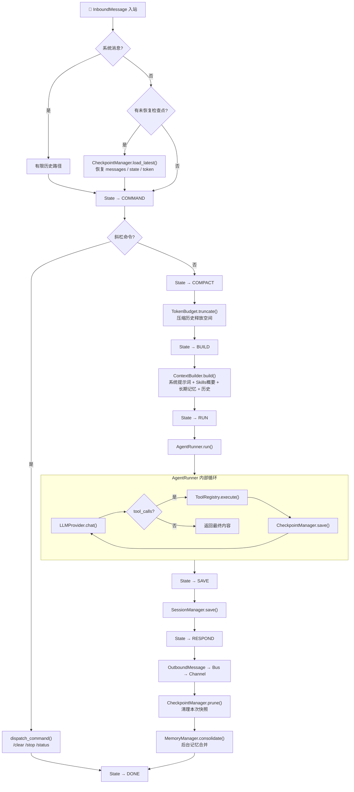

# MXWbot 第一版设计规格文档 (Design SPEC v1)

> **设计哲学**: 轻量、可维护、可扩展、安全优先
> **参考项目**: claw (多渠道) + nanobot (轻量架构) + hermes (记忆系统) + Harness (状态机)

---

## 一、项目目录结构总览

```
mxwbot/
├── __init__.py                          # 包入口，导出核心公共 API
├── pyproject.toml                       # 项目元数据与依赖声明
│
├── config/                              # ═══ 配置系统 ═══
│   ├── __init__.py                      # 导出 get_config / reload_config
│   ├── loader.py                        # 配置加载器（YAML/ENV → Schema）
│   ├── path.py                          # 运行时路径管理器
│   └── schema.py                        # Pydantic v2 配置模型全集
│
├── providers/                           # ═══ LLM 供应商抽象层 ═══
│   ├── __init__.py                      # 导出 LLMProvider / LLMResponse 等
│   ├── base.py                          # 抽象基类 + 公共数据结构
│   ├── openai_provider.py               # OpenAI 适配
│   ├── anthropic_provider.py            # Anthropic 适配
│   ├── deepseek_provider.py             # DeepSeek 适配
│   └── registry.py                      # Provider 注册中心（工厂模式）
│
├── core/                                # ═══ 核心编排层 ═══
│   ├── __init__.py                      # 导出核心组件
│   ├── loop.py                          # Loop — 中央编排器
│   ├── state.py                         # TurnState 状态机 + 降级策略
│   ├── context.py                       # ContextBuilder — 上下文组装器
│   ├── runner.py                        # AgentRunner — 纯引擎 LLM+Tool 循环
│   ├── hook.py                          # AgentHook — 钩子系统
│   ├── skill.py                         # SkillLoader — 技能加载与热更新
│   ├── subagent.py                      # SubAgentManager — 子代理管理
│   │
│   └── tools/                           # 工具子系统
│       ├── __init__.py                  # 导出 Tool / ToolRegistry
│       ├── base.py                      # Tool 抽象基类 + JSON_TYPE_MAP + 类型转换
│       ├── register.py                  # ToolRegistry — 工具注册/管理/执行
│       ├── filesystem.py                # 文件系统工具（Read/Write/Edit/List/Glob/Grep）
│       ├── web.py                       # Web 工具（Search + Fetch，支持多供应商）
│       ├── shell.py                     # Shell 命令执行工具
│       ├── cron.py                      # Cron 定时任务工具
│       ├── mcp.py                       # MCP 协议兼容工具
│       └── sandbox.py                   # 沙箱执行工具（bubblewrap）
│
├── memory/                              # ═══ 记忆系统 ═══
│   ├── __init__.py                      # 导出 MemoryManager
│   ├── core.py                          # MemoryManager — 记忆统筹调度
│   ├── working_memory.py                # 工作记忆（当前会话上下文）
│   ├── episodic_memory.py               # 情景记忆（摘要提取与 Token 控制）
│   ├── long_term_memory.py              # 长期记忆（SQLite + FTS5 全文检索）
│   ├── retrieval.py                     # 混合检索引擎（关键词 + 语义）
│   ├── update.py                        # 记忆写入（重要性判断 + 结构化存储）
│   ├── summarizer.py                    # LLM 摘要与关键信息提取器
│   └── token_budget.py                  # Token 计数器与预算管理
│
├── channel/                             # ═══ 多渠道接入层 ═══
│   ├── __init__.py                      # 导出 Channel 基类 + 注册中心
│   ├── base.py                          # BaseChannel — 频道抽象基类
│   ├── weixin.py                        # 微信频道适配（itchat/wechaty）
│   ├── qq.py                            # QQ 频道适配（go-cqhttp/napcat）
│   └── email.py                         # 邮件频道适配（IMAP/SMTP）
│
├── session/                             # ═══ 会话管理 ═══
│   ├── __init__.py                      # 导出 SessionManager
│   └── manager.py                       # JSONL 会话持久化 + 异步锁 + 边界保护
│
├── checkpoint/                          # ═══ 检查点与恢复 ═══
│   ├── __init__.py                      # 导出 CheckpointManager
│   └── manager.py                       # CheckpointManager — Runner 迭代快照保存与恢复
│
├── bus/                                 # ═══ 消息总线 ═══
│   ├── __init__.py                      # 导出 MessageBus / InboundMessage / OutboundMessage
│   ├── messages.py                      # InboundMessage + OutboundMessage 数据结构
│   └── queue.py                         # MessageBus — AsyncIO 双向消息队列
│
├── heartbeat/                           # ═══ 心跳与定时任务 ═══
│   ├── __init__.py                      # 导出 HeartbeatEngine
│   ├── scheduler.py                     # 后台定时调度器（独立进程）
│   └── storage.py                       # 任务持久化存储（SQLite）
│
├── watch/                               # ═══ 监控面板 ═══
│   ├── __init__.py                      # 导出 WatchPanel
│   └── panel.py                         # Rich 终端 UI（颜色/面板区分事件）
│
├── cli/                                 # ═══ 命令行入口 ═══
│   ├── __init__.py                      # CLI 包入口
│   └── main.py                          # Typer CLI 入口 + 子命令
│
├── skills/                              # ═══ 内置技能库 ═══
│   ├── __init__.py                      # Skills 包入口
│   ├── personality.py                   # 人格技能（总是加载）
│   └── builtin/                         # 内置技能定义文件（.md 格式）
│       ├── code-review.md               # 代码审查技能
│       ├── doc-writer.md                # 文档撰写技能
│       └── commit.md                    # Git 提交技能
│
├── utils/                               # ═══ 工具函数 ═══
│   ├── __init__.py                      # 导出公共工具
│   ├── security.py                      # 安全辅助（路径校验、命令注入检测）
│   ├── text.py                          # 文本处理（think 标签清洗、Token 估算）
│   ├── async_utils.py                   # 异步辅助（超时控制、并发限制）
│   └── logging.py                       # 结构化日志（JSONL 格式）
│
└── tests/                               # ═══ 测试 ═══
    ├── __init__.py
    ├── conftest.py                      # Pytest fixtures
    ├── test_config/                     # 配置测试
    ├── test_providers/                  # Provider 测试
    ├── test_core/                       # 核心编排测试
    ├── test_memory/                     # 记忆系统测试
    ├── test_channel/                    # 频道测试
    ├── test_tools/                      # 工具测试
    └── test_session/                    # 会话测试
```

---

## 二、系统架构图

### 2.1 分层架构总览

```
┌─────────────────────────────────────────────────────────────────┐
│                        ENTRY LAYER                              │
│  ┌──────────┐  ┌──────────┐  ┌──────────┐  ┌───────────────┐  │
│  │  WeChat  │  │    QQ    │  │  Email   │  │  CLI (typer)  │  │
│  │ Channel  │  │ Channel  │  │ Channel  │  │  mxwbot serve │  │
│  └────┬─────┘  └────┬─────┘  └────┬─────┘  └───────┬───────┘  │
│       │              │              │               │           │
├───────┼──────────────┼──────────────┼───────────────┼───────────┤
│       │              │              │               │           │
│       ▼              ▼              ▼               ▼           │
│  ┌──────────────────────────────────────────────────────────┐  │
│  │                     MESSAGE BUS                          │  │
│  │   InboundMessage ──→ input_queue ──→ Loop ──→ output_   │  │
│  │                                         queues ──→ OutboundMessage
│  └──────────────────────────────────────────────────────────┘  │
│                              │                                  │
├──────────────────────────────┼──────────────────────────────────┤
│                              ▼                                  │
│  ┌──────────────────────────────────────────────────────────┐  │
│  │                    CORE ORCHESTRATOR                      │  │
│  │                        Loop                               │  │
│  │  StateManager → ContextBuilder → AgentRunner → Session   │  │
│  │       ↑              ↑               ↑            ↑       │  │
│  │  TurnState      SkillLoader    ToolRegistry   Checkpoint  │  │
│  └───────────────────────┬──────────────────────────────────┘  │
│                          │                                      │
│         ┌────────────────┼────────────────┐                    │
│         ▼                ▼                ▼                    │
│  ┌─────────────┐  ┌─────────────┐  ┌─────────────┐            │
│  │ MemoryManager│  │ProviderReg. │  │SubAgentMgr  │            │
│  │ W→E→L 三级  │  │ OAI/Anth/DS │  │ max=5并发   │            │
│  └─────────────┘  └─────────────┘  └─────────────┘            │
│                                                                  │
├──────────────────────────────────────────────────────────────────┤
│                       INFRASTRUCTURE                              │
│  ┌──────────┐  ┌──────────┐  ┌──────────┐  ┌──────────────┐    │
│  │ Heartbeat│  │  Watch   │  │  Config  │  │   Security   │    │
│  │ (cron)   │  │ (Rich UI)│  │ (Pydantic)│  │  (utils/)    │    │
│  └──────────┘  └──────────┘  └──────────┘  └──────────────┘    │
└──────────────────────────────────────────────────────────────────┘
```

### 2.2 核心 Loop 处理流程



### 2.3 记忆系统三级架构

```
┌──────────────────────────────────────────────────────┐
│                  MemoryManager                       │
│                                                      │
│  ┌────────────────┐     ┌────────────────┐          │
│  │ Working Memory │────→│Episodic Memory │          │
│  │  (当前上下文)   │     │  (摘要压缩)     │          │
│  │  · 对话状态     │     │  · 窗口满触发   │          │
│  │  · 活跃实体     │     │  · 关键转折点   │          │
│  │  · 临时任务     │     │  · Token估算    │          │
│  └────────────────┘     └───────┬────────┘          │
│                                 │ 重要性 > 阈值      │
│                                 ▼                    │
│                      ┌─────────────────┐            │
│                      │ LongTerm Memory │            │
│                      │ (SQLite + FTS5) │            │
│                      │  · 结构化存储    │            │
│                      │  · 全文检索      │            │
│                      │  · 向量检索(可选)│            │
│                      └────────┬────────┘            │
│                               │                      │
│                      ┌────────▼────────┐            │
│                      │ HybridRetrieval │            │
│                      │  关键词 + 语义   │            │
│                      │  RRF 加权融合   │            │
│                      └─────────────────┘            │
└──────────────────────────────────────────────────────┘
```

### 2.4 状态转移与降级矩阵

```
        ┌──────────────────────────────────────────┐
        │              TurnState 状态机              │
        │                                          │
        │  RESTORE → COMPACT → COMMAND → BUILD     │
        │     ↑                         ↓           │
        │     └──── 异常回退 ───────── RUN          │
        │              ↑                  ↓         │
        │              └─── SAVE ←────────┘         │
        │                       ↓                   │
        │                    RESPOND → DONE          │
        └──────────────────────────────────────────┘

┌──────────────────┬────────────────────┬──────────────────┐
│     故障组件      │      降级行为       │     恢复策略      │
├──────────────────┼────────────────────┼──────────────────┤
│ MCP Server 断开   │ 该MCP工具不可用      │ 定时重连(指数退避) │
│ Memory DB 失败    │ 仅Session+本地文件   │ 自动切回内存模式   │
│ Channel 断开      │ 该频道消息暂存队列    │ 指数退避重连      │
│ Rate Limit 触发   │ 降低处理速度         │ 滑动窗口动态调整   │
│ Disk 满          │ 拒绝写操作/只读+告警  │ 主动告警通知      │
│ Runner 中断       │ 从Checkpoint恢复     │ load_latest()    │
└──────────────────┴────────────────────┴──────────────────┘
```

---

## 三、各模块详细说明

### 3.1 config/ — 配置系统

| 文件 | 职责 | 核心类/函数 |
|------|------|-------------|
| `loader.py` | 从 YAML/ENV/JSON 加载配置，合并优先级（ENV > YAML > 默认值），支持 `reload()` 热重载 | `ConfigLoader.load()`, `ConfigLoader.reload()` |
| `path.py` | 基于 `MXWConfig.workspace` 推导所有运行时目录，自动创建缺失目录，提供 `get_*_path()` 系列方法 | `PathManager` |
| `schema.py` | 所有配置的 Pydantic v2 模型定义，严格类型校验，`SecretStr` 处理敏感信息 | `MXWConfig`, `ProviderConfig`, `ChannelConfig`, `ToolsConfig`, `HeartBeatConfig`, `GatewayConfig`, `WebToolsConfig`, `WebSearchConfig`, `WebFetchConfig`, `ExecToolConfig`, `McpConfig`, `MemoryConfig`, `AgentDefaultConfig` |

**设计重点**:
- 单一 `MXWConfig` 根模型，所有子配置通过组合关系内聚
- 敏感字段使用 `SecretStr`，序列化时自动脱敏
- `path.py` 不依赖配置以外的全局状态，纯函数式推导

---

### 3.2 providers/ — LLM 供应商抽象

| 文件 | 职责 | 核心类/函数 |
|------|------|-------------|
| `base.py` | 定义 `LLMProvider` 抽象基类、`LLMResponse`、`ToolCallRequest`、`TokenUsage` 数据结构 | `LLMProvider`, `LLMResponse`, `ToolCallRequest`, `TokenUsage` |
| `openai_provider.py` | OpenAI 适配实现（兼容 OpenAI/兼容 API） | `OpenAIProvider(LLMProvider)` |
| `anthropic_provider.py` | Anthropic Claude 适配实现 | `AnthropicProvider(LLMProvider)` |
| `deepseek_provider.py` | DeepSeek 适配实现 | `DeepSeekProvider(LLMProvider)` |
| `registry.py` | 工厂模式注册中心，通过 `provider_name` 获取实例 | `ProviderRegistry` |

**设计重点**:
- 基类定义统一接口：`chat()` 返回 `LLMResponse`（含 content / tool_calls / usage）
- 每个 Provider 负责将内部格式统一转换为 `ToolCallRequest` 标准格式
- streaming 通过 `AsyncIterator[str]` 统一
- 新增供应商只需继承基类 + 注册即可（开闭原则）

---

### 3.3 core/ — 核心编排层

#### 3.3.1 loop.py — 中央编排器

| 类/函数 | 职责 |
|----------|------|
| `Loop` | 六大组件（ContextBuilder / AgentRunner / SubAgentManager / MemoryManager / ToolRegistry / SessionManager）的编排者 |
| `Loop.run(input_msg)` | 核心流程入口：消息预处理 → Session 获取 → 命令分发 → Token 预算 → 上下文构建 → Runner 执行 → 保存 → 后台记忆合并 |
| `Loop._dispatch_command(cmd)` | 处理 `/clear` `/stop` `/status` 等斜杠命令 |
| `Loop._preprocess_text(text)` | 输入预处理（去冗余空白、压缩重复内容） |

**核心流程**:
```
1. 系统消息检测 → 特殊路径（有限历史）
2. 记录输入消息
3. 获取/创建 Session（按 channel:chat_id）
4. 检查是否有未恢复的 Checkpoint → 从断点续跑
5. 斜杠命令分发（/clear、/stop 等）
6. Token 预算记忆合并（在上下文构建前释放空间）
7. 上下文构建（系统提示词 + 历史 + 用户消息 + Skills）
8. AgentRunner.run() —— LLM+工具循环（每次迭代自动保存检查点）
9. 保存本轮消息到 Session
10. 清理本次 Checkpoint 快照
11. 调度后台记忆合并
```

#### 3.3.2 state.py — 状态机

| 类 | 职责 |
|-----|------|
| `TurnState(Enum)` | RESTORE → COMPACT → COMMAND → BUILD → RUN → SAVE → RESPOND → DONE |
| `StateManager` | 状态转换管理，维护当前状态，执行合法状态转移，记录状态锚点 |
| `DegradationPolicy` | 降级策略：MCP断开/内存DB失败/频道断开/RateLimit/Disk满 → 对应的 Fallback 行为 |

**状态转移图**:
```
RESTORE → COMPACT → COMMAND → BUILD → RUN → SAVE → RESPOND → DONE
                ↑                                    │
                └────────── 异常回退 ─────────────────┘
```

**降级矩阵**:
| 故障组件 | 降级行为 | 恢复策略 |
|----------|----------|----------|
| MCP Server 断开 | 该 MCP 工具不可用，其余正常 | 定时重连 |
| Memory DB 失败 | 仅使用 Session 历史 + 本地文件 | 自动切回内存模式 |
| Channel 断开 | 该频道消息暂存队列 | 指数退避重连 |
| Rate Limit | 自动降低处理速度 | 滑动窗口动态调整 |
| Disk 满 | 拒绝写操作，只读 + 告警 | 主动告警通知 |

#### 3.3.3 context.py — 上下文构建器

| 类/方法 | 职责 |
|----------|------|
| `ContextBuilder` | 组装完整上下文（系统提示词 + 身份信息 + Skills概要 + 长期记忆 + 历史 + 用户消息） |
| `build_system_prompt()` | 生成系统级提示词（身份、行为准则、工作区路径、memory位置） |
| `build_skills_summary()` | 生成 XML 格式的技能摘要列表 |
| `build_memory_context()` | 从长期记忆中检索相关上下文 |

**上下文结构**:
```
┌──────────────────────────────┐
│ Identity (平台/路径/准则)     │  ← 总是包含
├──────────────────────────────┤
│ Skills Summary (XML 列表)    │  ← 总是包含（轻量）
├──────────────────────────────┤
│ Long-term Memory (检索结果)  │  ← 有查询时包含
├──────────────────────────────┤
│ Always-load Skills (如人格)  │  ← 1-2个小技能全文
├──────────────────────────────┤
│ Conversation History         │  ← Token 预算截断后
├──────────────────────────────┤
│ Current User Message         │
└──────────────────────────────┘
```

#### 3.3.4 runner.py — 纯引擎循环

| 类 | 职责 |
|-----|------|
| `AgentRunSpec` | 单次 Agent 执行配置：消息列表、工具注册表、模型、最大迭代、Hook |
| `AgentRunner` | 纯引擎：LLM调用 → 工具执行 → 再调用的循环 |
| `AgentRunResult` | 执行结果：最终内容、迭代次数、工具调用数、Token 消耗 |

**AgentRunner 核心循环**:
```python
for iteration in range(spec.max_iterations):
    response = await provider.chat(messages, tools, stream=True)
    if response.content and not response.tool_calls:
        break  # 纯文本响应，结束
    if response.tool_calls:
        results = await execute_tools(response.tool_calls)
        messages.extend(format_results(results))
    # 超时/Token预算检查
```

**保护机制**: `max_iterations=3`（默认）+ 60s 总超时 + Token 预算硬上限 + 每次迭代自动保存检查点

AgentRunner 每次迭代完成后调用 `checkpoint_callback` 保存快照，Runner 自身不感知检查点存储细节，由 Loop 注入回调：

```python
# Runner 内部
for iteration in range(spec.max_iterations):
    response = await provider.chat(messages, tools, stream=True)
    # ... 处理响应和工具调用 ...

    # 每次迭代后保存检查点（由外部注入回调）
    if spec.checkpoint_callback:
        await spec.checkpoint_callback(
            session_id=session_id,
            iteration=iteration,
            messages=messages,
            token_usage=total_usage,
        )
```

#### 3.3.5 hook.py — 钩子系统

| 类 | 职责 |
|-----|------|
| `AgentHook` | 生命周期钩子基类：`before_iteration` / `on_stream` / `on_stream_end` / `before_execute_tools` / `after_iteration` / `finalize_content` |
| `StreamProcessHook` | 流式输出处理 Hook（think 标签清洗 + 增量计算 + 回调转发）|

**流式处理管道**:
```
raw_delta → prev_clean + delta → 去 think → new_clean → incremental cut → callback
```

#### 3.3.6 skill.py — 技能系统

| 类 | 职责 |
|-----|------|
| `SkillLoader` | 扫描工作区 → 解析 XML 摘要 → 按需加载完整内容 → 热更新 |
| `Skill` | 单个技能实体（name, description, path, content, dependencies）|
| `SkillMeta` | 技能元数据（轻量，用于列表展示）|

**加载策略**:
1. 启动时扫描 `skills/` 和 `~/.mxwbot/skills/` 目录
2. 生成 XML 格式技能摘要列表（注入上下文，仅name+description）
3. LLM 按 name 调用 skill 时，首次才加载完整 `.md` 内容（懒加载）
4. 文件系统监控 → 文件变更自动触发热重载（watchdog）

#### 3.3.7 subagent.py — 子代理管理

| 类 | 职责 |
|-----|------|
| `SubAgentManager` | 子代理生命周期管理：spawn / cancel / status |
| `SubAgent` | 独立执行单元：隔离的 ToolRegistry + 独立 Context（不共享 Session）|
| `SubAgentStatus(Enum)` | PENDING / RUNNING / DONE / ERROR / CANCELLED |

**约束**: 全局最大并发 5，每个子代理独立 FileStates，31 秒超时

#### 3.3.8 tools/ — 工具子系统

| 文件 | 职责 |
|------|------|
| `base.py` | `Tool` 抽象基类：name / description / parameters (JSON Schema) / execute / is_readonly / can_parallel；全局 `JSON_TYPE_MAP`；类型转换 + JSON Schema 验证链 |
| `register.py` | `ToolRegistry`：注册/获取/列表/OpenAI格式Schema导出；Loop 启动时注册必备工具，其余按需懒注册 |
| `filesystem.py` | `ReadFileTool` / `WriteFileTool` / `EditFileTool` / `ListDirTool` / `GlobTool` / `GrepTool`，基类+具体实现，workspace约束+allowed_dir安全边界 |
| `web.py` | `WebSearchTool`（DuckDuckGo/Tavily/Kagi）+ `WebFetchTool`，通过配置选择供应商 |
| `shell.py` | `ShellTool`：执行 Shell 命令，支持 timeout/workspace限制/env白名单/pattern黑白名单 |
| `cron.py` | `CronTool`：定时提醒和任务调度 |
| `mcp.py` | `McpTool`：兼容 MCP 协议，连接/列举/调用 |
| `sandbox.py` | `SandboxTool`：基于 bubblewrap 的安全命令执行 |

---

### 3.4 memory/ — 记忆系统

| 文件 | 职责 | 核心类 |
|------|------|--------|
| `core.py` | `MemoryManager` — 统一记忆统筹：调度工作记忆、触发摘要、写入长期记忆 | `MemoryManager` |
| `working_memory.py` | 当前会话上下文（对话状态、活跃实体、临时任务信息）| `WorkingMemory` |
| `episodic_memory.py` | 情景摘要：窗口满时触发摘要压缩，保留关键转折点 | `EpisodicMemory` |
| `long_term_memory.py` | SQLite + FTS5 持久化存储，支持向量检索（可选 embedding 扩展）| `LongTermMemory` |
| `retrieval.py` | 混合检索：关键词(BM25) + 语义(embedding) → 加权融合(rrf) | `HybridRetrieval` |
| `update.py` | 结构化写入：重要性评分 → 去重 → 写入 → 索引更新 | `MemoryUpdater` |
| `summarizer.py` | 调用 LLM 生成摘要、提取关键信息、评分重要性 | `MemorySummarizer` |
| `token_budget.py` | Token 计数器、剩余 Token 估算、消息裁剪 | `TokenBudget` |

**记忆架构**:
```
┌─────────────────────────────────────────┐
│            MemoryManager                │
│  ┌───────────┐  ┌───────────┐          │
│  │ Working   │  │ Episodic  │          │
│  │ Memory    │→ │ Memory    │→ 写入     │
│  │(当前上下文)│  │(摘要压缩) │          │
│  └───────────┘  └───────────┘          │
│                        ↓                │
│              ┌─────────────────┐        │
│              │ LongTerm Memory │        │
│              │ (SQLite + FTS5) │        │
│              └─────────────────┘        │
│                        ↓                │
│              ┌─────────────────┐        │
│              │ HybridRetrieval │        │
│              │ (关键词+语义)    │        │
│              └─────────────────┘        │
└─────────────────────────────────────────┘
```

---

### 3.5 channel/ — 多渠道层

| 文件 | 职责 |
|------|------|
| `base.py` | `BaseChannel` 抽象类：定义 `start()/stop()/send()/on_message()` 统一接口，消息发送到 MessageBus |
| `weixin.py` | 微信频道适配，支持 wechaty/itchat 等适配器 |
| `qq.py` | QQ 频道适配，支持 go-cqhttp/napcat 等协议 |
| `email.py` | 邮件频道，通过 IMAP 轮询 + SMTP 发送，可配置轮询间隔 |

**频道设计原则**: Channel 产生 `InboundMessage` → Bus → Loop 处理 → 产生 `OutboundMessage` → Bus → Channel 消费并发送

---

### 3.6 bus/ — 消息总线

| 文件 | 职责 |
|------|------|
| `messages.py` | `InboundMessage` — 入站消息（Channel → Agent）；`OutboundMessage` — 出站消息（Agent → Channel），含 `reply_to` 关联原始入站消息 |
| `queue.py` | `MessageBus` — 基于 `asyncio.Queue` 的异步双向消息队列，`input_queue` 收拢所有入站，`output_queues` 按频道分发出站 |

**消息流**:
```
Channel → Bus.publish_inbound(InboundMessage) → Loop.run()
Loop 处理完成 → Bus.publish_outbound(OutboundMessage) → Channel.consume()
```

---

### 3.7 checkpoint/ — 检查点与恢复

| 文件 | 职责 |
|------|------|
| `manager.py` | `CheckpointManager` — Runner 每次迭代后自动保存执行快照；意外中断后从最近检查点恢复，避免重复消耗 Token；自动清理过期快照 |

**数据结构**:

| 类 | 字段 | 职责 |
|-----|------|------|
| `CheckpointSnapshot` | id, session_id, iteration, messages, tool_results, token_usage, state, created_at | 完整快照，可完整恢复 Runner 状态 |
| `CheckpointSummary` | id, iteration, state, created_at | 轻量摘要，用于列表展示 |

**核心方法**:

| 方法 | 职责 |
|------|------|
| `save(session_id, iteration, messages, tool_results, token_usage, state)` | 保存快照到 `{checkpoint_dir}/{session_id}/ckpt_{iteration}.json` |
| `load_latest(session_id)` | 加载该 session 最近一次快照，无则返回 None |
| `load(checkpoint_id)` | 按 ID 加载指定快照 |
| `list_by_session(session_id)` | 列出该 session 所有快照摘要 |
| `prune(session_id, keep_last=5)` | 仅保留最近 N 个快照，删除旧文件 |

**恢复流程**:
```
Loop.run() 进入时:
  → CheckpointManager.load_latest(session_id)
    → 有快照?
       是 → 恢复 messages / tool_results / token_usage / TurnState
       → 从断点继续执行（跳过已完成迭代）
       否 → 正常冷启动
  → Runner.run() 每次迭代后:
    → CheckpointManager.save(...)  ← 自动保存
  → Loop 正常完成:
    → CheckpointManager.prune(session_id)  ← 清理本次快照
```

**安全设计**:
- 快照文件写入临时文件 + 原子 rename，防止写入中断导致损坏
- 文件名校验防止路径穿越
- 快照文件大小硬上限 10MB，超出拒绝写入
- 仅保存必要状态，不备份完整 Session 历史

---

### 3.8 session/ — 会话管理

| 文件 | 职责 |
|------|------|
| `manager.py` | `SessionManager` — JSONL 持久化 + `asyncio.Lock` 防竞态 + 边界保护（单文件最大 1000 条消息，超出自动 compact）；`Session` 数据结构 |

**安全设计**:
- JSONL 格式保证写入原子性（追加一行）
- 文件名校验：`channel_chat_id.jsonl`，防止路径穿越
- 异常时保留原始数据，回滚到上次合法状态

---

### 3.9 heartbeat/ — 心跳引擎

| 文件 | 职责 |
|------|------|
| `scheduler.py` | `TaskScheduler` — 基于 cron 表达式的后台定时调度（独立线程/进程）|
| `storage.py` | `TaskStorage` — SQLite 持久化任务，重启不丢失 |

---

### 3.10 watch/ — 监控面板

| 文件 | 职责 |
|------|------|
| `panel.py` | `WatchPanel` — Rich 终端 UI，颜色/面板区分事件类型（INFO=绿/WARN=黄/ERROR=红/TOOL=蓝/LLM=紫），针对 Loop 核心事件进行审计 |

---

### 3.11 cli/ — 命令行入口

| 文件 | 职责 |
|------|------|
| `main.py` | 基于 Typer 的 CLI：`mxwbot serve`（启动服务）、`mxwbot config`（配置管理）、`mxwbot watch`（打开监控面板）、`mxwbot skill list`（列出技能）|

---

### 3.12 utils/ — 工具函数

| 文件 | 职责 |
|------|------|
| `security.py` | 路径穿越检测、命令注入模式匹配、敏感信息过滤 |
| `text.py` | `clean_think_tags()` 清洗 `<think>` 标签、`estimate_tokens()` Token 估算、`truncate_messages()` 消息裁剪 |
| `async_utils.py` | `timeout()` 异步超时包装器、`ConcurrencyLimiter` 并发控制 |
| `logging.py` | 结构化日志（JSONL），支持 Level/Module/Timestamp 过滤 |

---

## 四、优秀设计重点与介绍

### 4.1 六大设计原则落地

| 原则 | 落地方式 |
|------|----------|
| **开闭原则** | Provider / Channel / Tool 均采用抽象基类 + 注册机制，新增无需修改核心代码 |
| **单一职责** | Loop 只做编排，Runner 只做引擎循环，ContextBuilder 只做上下文组装 |
| **迪米特法则** | 模块间通过接口/总线通信，Loop 不直接操作 Channel 内部 |
| **接口隔离** | AgentHook 只暴露必要生命周期方法，Tool 只暴露 name/description/execute |
| **依赖倒转** | 所有高层模块依赖抽象（LLMProvider / Tool / BaseChannel），不依赖具体实现 |
| **安全优先** | 工具级安全边界（路径校验/命令注入检测/沙箱）、配置敏感字段脱敏 |

### 4.2 核心架构亮点

**1. 三层增强 ReAct 循环**
```
Layer 1: Plan — 复杂任务自动分解为子任务（任务复杂度 > 阈值时触发）
Layer 2: Enhanced ReAct — Context → Reason → Act → Observe → Reflect（含预算+超时）
Layer 3: Metacognition — 结果验证 → 自我评估 → 记忆更新
```

**2. State 锚点 + 降级矩阵**
- 每轮对话经过 8 个显式状态，监控可精确到状态锚点
- 5 种故障场景有预定义降级策略，保证 Never Crash Silently

**3. Token 预算三级管理**
- 上下文构建前主动 compact（释放空间）
- Runner 循环中有 hard limit
- 后台 MemoryManager 持续合并长期记忆

**4. 流式处理管道**
- Hook 拦截 raw delta → think 标签清洗 → 增量裁剪 → 业务回调
- 四个步骤，每步可独立测试

**5. 全异步消息总线**
- Channel ↔ Agent 完全解耦
- 新增 Channel 只需实现 `BaseChannel` + 订阅对应 Queue

**6. 懒加载 Skills**
- 上下文只注入轻量 Summary XML（name+description），按需加载全文
- 热更新无需重启

**7. 检查点与断点续跑**
- Runner 每次迭代后自动保存执行快照（消息列表、工具结果、Token 消耗）
- 意外中断后从最近检查点恢复，避免重复消耗 Token
- 正常完成后自动清理快照，不占磁盘
- 快照文件原子写入 + 大小硬上限，保证安全

### 4.3 节省 Token 的设计

1. **Skills Summary XML**: 只注入技能名称和一句话描述，不加载全文
2. **Episodic Memory 压缩**: 对话轮次达到阈值自动摘要压缩，保留关键信息
3. **Think 标签清洗**: 流式输出中去除推理标签，仅发送最终内容给用户
4. **消息预处理**: 输入去冗余空白、合并重复内容
5. **渐进式 Memory 加载**: 先检索再注入，不是全量注入上下文

### 4.4 安全设计清单

- [x] `SecretStr` 保护 API Key 等敏感配置
- [x] `allowed_dir` 文件系统工具边界限制
- [x] `ShellTool` 命令注入模式检测 + sandbox 模式
- [x] 路径穿越检测 (`security.py`)
- [x] Session JSONL 文件名校验
- [x] Token / CPU / 内存 / 时间 四维预算硬上限
- [x] 工具只读标记 (`is_readonly`)，需要用户确认才能写

---

## 五、启动流程

```
CLI (cli/main.py)
  → ConfigLoader.load("config.yaml")
    → MXWConfig (Pydantic 验证)
      → PathManager 创建运行时目录
  → ProviderRegistry 初始化 LLM Provider
  → MemoryManager 初始化 SQLite + FTS5
  → SkillLoader.scan_workspace() 扫描技能
  → CheckpointManager 初始化检查点目录
  → SessionManager 恢复活跃会话（含未恢复检查点检测）
  → HeartbeatEngine 启动定时任务
  → MessageBus 创建队列
  → Channel(s) 启动（weixin / qq / email）
  → Loop 等待消息…

消息到达:
  Channel.on_message → Bus.publish_inbound(InboundMessage) → Loop.run → [状态机]
  → OutboundMessage → Bus.publish_outbound → Channel.consume → Channel.send
```

---

## 六、依赖项 (pyproject.toml 节选)

```toml
[project]
name = "mxwbot"
version = "0.1.0"
requires-python = ">=3.11"

dependencies = [
    "pydantic>=2.0",
    "typer>=0.9",
    "rich>=13.0",
    "httpx>=0.25",
    "openai>=1.0",
    "anthropic>=0.30",
    "watchdog>=4.0",
    "croniter>=2.0",
    "tiktoken>=0.5",
    "aiofiles>=23.0",
    "pyyaml>=6.0",
]

[project.optional-dependencies]
wechat = ["wechaty>=0.10"]
qq = ["napcat>=1.0"]
email = ["aioimaplib>=1.0", "aiosmtplib>=3.0"]
sandbox = ["bubblewrap>=0.1"]
```

---

> **版本**: v1.0 | **日期**: 2026-05-11 | **状态**: 设计评审中


