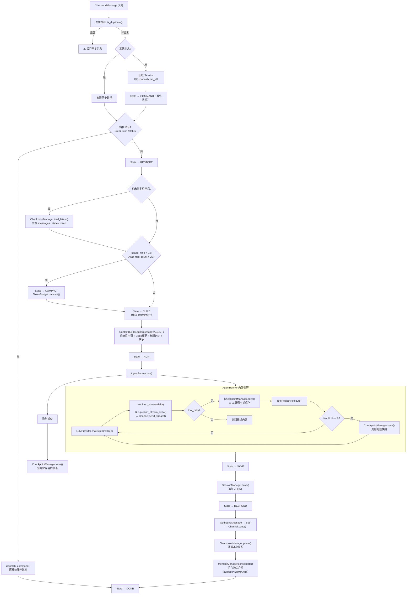

# MXWbot 第一版设计规格文档 (Design SPEC v1)

> **设计哲学**: 轻量、可维护、可扩展、安全优先
> **参考项目**: claw (多渠道) + nanobot (轻量架构) + hermes (记忆系统) + Harness (状态机)

---

## 一、项目目录结构总览

```
mxwbot/
├── __init__.py                          # 包入口，导出核心公共 API
├── pyproject.toml                       # 项目元数据与依赖声明
│
├── config/                              # ═══ 配置系统 ═══
│   ├── __init__.py                      # 导出 get_config / reload_config
│   ├── loader.py                        # 配置加载器（YAML/ENV → Schema）
│   ├── path.py                          # 运行时路径管理器
│   └── schema.py                        # Pydantic v2 配置模型全集
│
├── providers/                           # ═══ LLM 供应商抽象层 ═══
│   ├── __init__.py                      # 导出 LLMProvider / LLMResponse 等
│   ├── base.py                          # 抽象基类 + 公共数据结构（含 LLMCallPurpose）
│   ├── openai_provider.py               # OpenAI 适配
│   ├── anthropic_provider.py            # Anthropic 适配
│   ├── deepseek_provider.py             # DeepSeek 适配
│   └── registry.py                      # Provider 注册中心（工厂模式）
│
├── core/                                # ═══ 核心编排层 ═══
│   ├── __init__.py                      # 导出核心组件
│   ├── loop.py                          # Loop — 中央编排器（Session隔离并发）
│   ├── state.py                         # TurnState 状态机 + 降级策略
│   ├── context.py                       # ContextBuilder — 按 LLMCallPurpose 分支
│   ├── runner.py                        # AgentRunner — 纯引擎 + 策略驱动 Checkpoint
│   ├── hook.py                          # AgentHook — 钩子系统（含流式→Bus）
│   ├── skill.py                         # SkillLoader — 技能加载与热更新
│   ├── subagent.py                      # SubAgentManager — 完整子代理管理
│   │
│   └── tools/                           # 工具子系统
│       ├── __init__.py                  # 导出 Tool / ToolRegistry
│       ├── base.py                      # Tool 抽象基类 + JSON_TYPE_MAP + 类型转换
│       ├── register.py                  # ToolRegistry — 工具注册/管理/执行
│       ├── filesystem.py                # 文件系统工具（Read/Write/Edit/List/Glob/Grep）
│       ├── web.py                       # Web 工具（Search + Fetch，支持多供应商）
│       ├── shell.py                     # Shell 命令执行工具
│       ├── cron.py                      # Cron 定时任务工具
│       ├── mcp.py                       # MCP 协议兼容工具
│       └── sandbox.py                   # 沙箱执行工具（bubblewrap）
│
├── memory/                              # ═══ 记忆系统 ═══
│   ├── __init__.py                      # 导出 MemoryManager
│   ├── core.py                          # MemoryManager — 记忆统筹调度
│   ├── working_memory.py                # 工作记忆（当前会话上下文）
│   ├── episodic_memory.py               # 情景记忆（摘要提取与 Token 控制）
│   ├── long_term_memory.py              # 长期记忆（SQLite + FTS5 全文检索）
│   ├── retrieval.py                     # 混合检索引擎（关键词 + 语义）
│   ├── update.py                        # 记忆写入（重要性判断 + 结构化存储）
│   ├── summarizer.py                    # LLM 摘要与关键信息提取器（purpose=SUMMARY 隔离）
│   └── token_budget.py                  # Token 计数器与预算管理（含 usage_ratio）
│
├── channel/                             # ═══ 多渠道接入层 ═══
│   ├── __init__.py                      # 导出 Channel 基类 + 注册中心
│   ├── base.py                          # BaseChannel — 频道抽象基类（含 send_stream）
│   ├── weixin.py                        # 微信频道适配（itchat/wechaty）
│   ├── qq.py                            # QQ 频道适配（go-cqhttp/napcat）
│   └── email.py                         # 邮件频道适配（IMAP/SMTP）
│
├── session/                             # ═══ 会话管理 ═══
│   ├── __init__.py                      # 导出 SessionManager
│   └── manager.py                       # JSONL 会话持久化 + 异步锁 + 去重缓存 + 边界保护
│
├── checkpoint/                          # ═══ 检查点与恢复 ═══
│   ├── __init__.py                      # 导出 CheckpointManager
│   └── manager.py                       # CheckpointManager — 策略驱动的快照保存与恢复
│
├── bus/                                 # ═══ 消息总线 ═══
│   ├── __init__.py                      # 导出 MessageBus / InboundMessage / OutboundMessage
│   ├── messages.py                      # InboundMessage（含去重键） + OutboundMessage（含流式标记）
│   └── queue.py                         # MessageBus — 双向消息队列 + 流式通道
│
├── heartbeat/                           # ═══ 心跳与定时任务 ═══
│   ├── __init__.py                      # 导出 HeartbeatEngine
│   ├── scheduler.py                     # 后台定时调度器（独立进程）
│   └── storage.py                       # 任务持久化存储（SQLite）
│
├── watch/                               # ═══ 监控面板 ═══
│   ├── __init__.py                      # 导出 WatchPanel
│   ├── panel.py                         # Rich 终端 UI（颜色/面板区分事件）
│   └── metrics.py                       # 结构化指标体系（System/Agent/Channel/Degradation）
│
├── cli/                                 # ═══ 命令行入口 ═══
│   ├── __init__.py                      # CLI 包入口
│   └── main.py                          # Typer CLI 入口 + 子命令
│
├── skills/                              # ═══ 内置技能库 ═══
│   ├── __init__.py                      # Skills 包入口
│   ├── personality.py                   # 人格技能（总是加载）
│   └── builtin/                         # 内置技能定义文件（.md 格式）
│       ├── code-review.md               # 代码审查技能
│       ├── doc-writer.md                # 文档撰写技能
│       └── commit.md                    # Git 提交技能
│
├── utils/                               # ═══ 工具函数 ═══
│   ├── __init__.py                      # 导出公共工具
│   ├── security.py                      # 安全辅助（路径校验、命令注入检测）
│   ├── text.py                          # 文本处理（think 标签清洗、Token 估算）
│   ├── async_utils.py                   # 异步辅助（超时控制、并发限制）
│   └── logging.py                       # 结构化日志（JSONL 格式）
│
└── tests/                               # ═══ 测试 ═══
    ├── __init__.py
    ├── conftest.py                      # Pytest fixtures
    ├── test_config/                     # 配置测试
    ├── test_providers/                  # Provider 测试
    ├── test_core/                       # 核心编排测试
    ├── test_memory/                     # 记忆系统测试
    ├── test_channel/                    # 频道测试
    ├── test_tools/                      # 工具测试
    └── test_session/                    # 会话测试
```

---

## 二、系统架构图

### 2.1 分层架构总览

```
┌─────────────────────────────────────────────────────────────────────┐
│                        ENTRY LAYER                                   │
│  ┌──────────┐  ┌──────────┐  ┌──────────┐  ┌───────────────┐      │
│  │  WeChat  │  │    QQ    │  │  Email   │  │  CLI (typer)  │      │
│  │ Channel  │  │ Channel  │  │ Channel  │  │  mxwbot serve │      │
│  │·send()   │  │·send()   │  │·send()   │  │               │      │
│  │·send_str │  │·send_str │  │·send_str │  │               │      │
│  └────┬─────┘  └────┬─────┘  └────┬─────┘  └───────┬───────┘      │
│       │              │              │               │               │
├───────┼──────────────┼──────────────┼───────────────┼───────────────┤
│       ▼              ▼              ▼               ▼               │
│  ┌──────────────────────────────────────────────────────────────┐  │
│  │                     MESSAGE BUS                               │  │
│  │                                                               │  │
│  │  InboundMessage ──→ input_queue ──→ dispatch per session      │  │
│  │       ↑                              │     │                  │  │
│  │  [去重检测]                     [session-1] [session-2] ...   │  │
│  │                                      │     │                  │  │
│  │  OutboundMessage ←── output_queues ←─┘     │                  │  │
│  │  StreamDelta      ←── stream_channels ←────┘                  │  │
│  └──────────────────────────────────────────────────────────────┘  │
│                              │                                      │
├──────────────────────────────┼──────────────────────────────────────┤
│                              ▼                                      │
│  ┌──────────────────────────────────────────────────────────────┐  │
│  │                    CORE ORCHESTRATOR                          │  │
│  │                        LoopPool                               │  │
│  │  ┌─────────────────────┐  ┌─────────────────────┐            │  │
│  │  │   Loop (session-1)  │  │   Loop (session-2)  │  ...       │  │
│  │  │  session Lock 串行   │  │  session Lock 串行   │            │  │
│  │  │                     │  │                     │            │  │
│  │  │  COMMAND → RESTORE →│  │  COMMAND → RESTORE →│            │  │
│  │  │  COMPACT* → BUILD → │  │  COMPACT* → BUILD → │            │  │
│  │  │  RUN → SAVE →       │  │  RUN → SAVE →       │            │  │
│  │  │  RESPOND → DONE     │  │  RESPOND → DONE     │            │  │
│  │  └─────────────────────┘  └─────────────────────┘            │  │
│  │         * COMPACT 仅当 usage_ratio > 0.8 时触发              │  │
│  │                                                               │  │
│  │  ┌──────────────────────────────────────────────────────┐    │  │
│  │  │  StateManager → ContextBuilder → AgentRunner → Session│   │  │
│  │  │       ↑              ↑               ↑            ↑   │    │  │
│  │  │  TurnState      SkillLoader    ToolRegistry   Checkpoint│  │
│  │  └──────────────────────────────────────────────────────┘    │  │
│  └──────────────────────────────────────────────────────────────┘  │
│                          │                                          │
│         ┌────────────────┼────────────────┐                        │
│         ▼                ▼                ▼                        │
│  ┌─────────────┐  ┌─────────────┐  ┌─────────────┐                │
│  │ MemoryManager│  │ProviderReg. │  │SubAgentMgr  │                │
│  │ W→E→L 三级  │  │ OAI/Anth/DS │  │ max=5 concurrent            │
│  │ purpose隔离  │  │             │  │ 独立Session  │                │
│  └─────────────┘  └─────────────┘  └─────────────┘                │
│                                                                     │
├─────────────────────────────────────────────────────────────────────┤
│                       INFRASTRUCTURE                                 │
│  ┌──────────┐  ┌──────────┐  ┌──────────┐  ┌──────────────┐      │
│  │ Heartbeat│  │  Watch   │  │  Config  │  │   Security   │      │
│  │ (cron)   │  │ (Rich UI)│  │ (Pydantic)│  │  (utils/)    │      │
│  │          │  │ +metrics │  │          │  │              │      │
│  └──────────┘  └──────────┘  └──────────┘  └──────────────┘      │
└─────────────────────────────────────────────────────────────────────┘
```

### 2.2 核心 Loop 处理流程



### 2.3 记忆系统三级架构 + Purpose 隔离

```
┌──────────────────────────────────────────────────────┐
│                  MemoryManager                       │
│                                                      │
│  ┌────────────────┐     ┌────────────────┐          │
│  │ Working Memory │────→│Episodic Memory │          │
│  │  (当前上下文)   │     │  (摘要压缩)     │          │
│  │  · 对话状态     │     │  · 窗口满触发   │          │
│  │  · 活跃实体     │     │  · 关键转折点   │          │
│  │  · 临时任务     │     │  · Token估算    │          │
│  └────────────────┘     └───────┬────────┘          │
│                                 │ 重要性 > 阈值      │
│                                 ▼                    │
│                      ┌─────────────────┐            │
│                      │ LongTerm Memory │            │
│                      │ (SQLite + FTS5) │            │
│                      └────────┬────────┘            │
│                               │                      │
│                      ┌────────▼────────┐            │
│                      │ HybridRetrieval │            │
│                      │  关键词 + 语义   │            │
│                      └─────────────────┘            │
└──────────────────────────────────────────────────────┘

LLMCallPurpose 隔离:
┌────────────────┬──────────────────┬──────────────────┐
│   purpose      │  记忆注入         │  Skills 注入      │
├────────────────┼──────────────────┼──────────────────┤
│ AGENT（正常对话）│ 完整检索 + 注入   │ XML概要 + 按需   │
│ SUMMARY（摘要） │ 禁止              │ 禁止             │
│ SYSTEM（内部）  │ 禁止              │ 禁止             │
└────────────────┴──────────────────┴──────────────────┘
```

### 2.4 状态转移与降级矩阵

```
        ┌──────────────────────────────────────────┐
        │           TurnState 状态机（修正版）        │
        │                                          │
        │  COMMAND → RESTORE → COMPACT* → BUILD    │
        │     │         ↑           ↓               │
        │     │         └── 异常回退 ─ RUN           │
        │     │                       ↓              │
        │     └────────────────→ SAVE               │
        │                          ↓                │
        │                       RESPOND → DONE      │
        │                                          │
        │  * COMPACT 仅当 usage_ratio > 0.8 且      │
        │    msg_count > 20 时触发，否则直接 BUILD   │
        └──────────────────────────────────────────┘

┌──────────────────┬────────────────────┬──────────────────┐
│     故障组件      │      降级行为       │     恢复策略      │
├──────────────────┼────────────────────┼──────────────────┤
│ MCP Server 断开   │ 该MCP工具不可用      │ 定时重连(指数退避) │
│ Memory DB 失败    │ 仅Session+本地文件   │ 自动切回内存模式   │
│ Channel 断开      │ 该频道消息暂存队列    │ 指数退避重连      │
│ Rate Limit 触发   │ 降低处理速度         │ 滑动窗口动态调整   │
│ Disk 满          │ 拒绝写操作/只读+告警  │ 主动告警通知      │
│ Runner 异常       │ Checkpoint恢复       │ load_latest()    │
└──────────────────┴────────────────────┴──────────────────┘
```

---

## 三、各模块详细说明

### 3.1 config/ — 配置系统

| 文件 | 职责 | 核心类/函数 |
|------|------|-------------|
| `loader.py` | 从 YAML/ENV/JSON 加载配置，合并优先级（ENV > YAML > 默认值），支持 `reload()` 热重载 | `ConfigLoader.load()`, `ConfigLoader.reload()` |
| `path.py` | 基于 `MXWConfig.workspace` 推导所有运行时目录，自动创建缺失目录，提供 `get_*_path()` 系列方法 | `PathManager` |
| `schema.py` | 所有配置的 Pydantic v2 模型定义，严格类型校验，`SecretStr` 处理敏感信息 | `MXWConfig`, `ProviderConfig`, `ChannelConfig`, `ToolsConfig`, `HeartBeatConfig`, `GatewayConfig`, `WebToolsConfig`, `WebSearchConfig`, `WebFetchConfig`, `ExecToolConfig`, `McpConfig`, `MemoryConfig`, `AgentDefaultConfig` |

**设计重点**:
- 单一 `MXWConfig` 根模型，所有子配置通过组合关系内聚
- 敏感字段使用 `SecretStr`，序列化时自动脱敏
- `path.py` 不依赖配置以外的全局状态，纯函数式推导

---

### 3.2 providers/ — LLM 供应商抽象

| 文件 | 职责 | 核心类/函数 |
|------|------|-------------|
| `base.py` | 定义 `LLMProvider` 抽象基类、`LLMResponse`、`ToolCallRequest`、`TokenUsage`、`LLMCallPurpose` 枚举 | `LLMProvider`, `LLMResponse`, `ToolCallRequest`, `TokenUsage`, `LLMCallPurpose` |
| `openai_provider.py` | OpenAI 适配实现（兼容 OpenAI/兼容 API） | `OpenAIProvider(LLMProvider)` |
| `anthropic_provider.py` | Anthropic Claude 适配实现 | `AnthropicProvider(LLMProvider)` |
| `deepseek_provider.py` | DeepSeek 适配实现 | `DeepSeekProvider(LLMProvider)` |
| `registry.py` | 工厂模式注册中心，通过 `provider_name` 获取实例 | `ProviderRegistry` |

**设计重点**:
- 基类定义统一接口：`chat()` 返回 `LLMResponse`（含 content / tool_calls / usage）
- 每个 Provider 负责将内部格式统一转换为 `ToolCallRequest` 标准格式
- streaming 通过 `AsyncIterator[str]` 统一
- 新增供应商只需继承基类 + 注册即可（开闭原则）

**LLMCallPurpose 枚举** — 解决记忆系统递归依赖:

```python
class LLMCallPurpose(Enum):
    AGENT   = "agent"    # 正常 Agent 对话 → 完整上下文（记忆 + Skills）
    SUMMARY = "summary"  # 摘要生成       → 最小上下文（仅 system prompt）
    SYSTEM  = "system"   # 系统内部调用    → 最小上下文（仅 system prompt）
```

---

### 3.3 core/ — 核心编排层

#### 3.3.1 loop.py — 中央编排器（Session 隔离并发）

| 类/函数 | 职责 |
|----------|------|
| `LoopPool` | 全局并发管理：最多同时处理 20 个独立 Session，通过 `asyncio.Semaphore` 限流 |
| `Loop` | 六大组件的编排者，每个 Session 独立一个 Loop 实例 |
| `Loop.run(input_msg)` | 消息去重 → 命令分发 → 条件 Compact → 上下文构建 → Runner 执行 → 保存 |
| `Loop._get_session_lock(key)` | 同一 `channel:chat_id` 的消息串行处理（`asyncio.Lock`），不同 Session 并行 |
| `Loop._dispatch_command(cmd)` | 处理 `/clear` `/stop` `/status` 等斜杠命令 |
| `Loop._preprocess_text(text)` | 输入预处理（去冗余空白、压缩重复内容） |

**并发模型**:
```
MessageBus.dispatch()
  → session_key = f"{msg.channel}:{msg.chat_id}"
  → asyncio.create_task(LoopPool.run(session_key, msg))
    → LoopPool._semaphore.acquire()          # 全局并发上限 20
    → async with Loop._session_locks[session_key]:  # 同一 session 串行
        → Loop._process(msg)
```

**核心流程**:
```
1. 去重检测 → is_duplicate()? → 是则丢弃
2. 系统消息检测 → 特殊路径（有限历史）
3. 获取/创建 Session（按 channel:chat_id）
4. State → COMMAND（首先执行命令检测）
5. 斜杠命令分发（/clear、/stop、/status 等）→ 命令直接处理并结束
6. State → RESTORE → 检查是否有未恢复 Checkpoint → 有则恢复
7. TokenBudget.usage_ratio > 0.8 且 msg_count > 20 → COMPACT → 压缩历史
   否则跳过 COMPACT，直接 BUILD
8. State → BUILD → ContextBuilder.build(purpose=AGENT)
9. State → RUN → AgentRunner.run()
10. State → SAVE → SessionManager.save()
11. State → RESPOND → 发送 OutboundMessage
12. CheckpointManager.prune() 清理本次快照
13. MemoryManager.consolidate(purpose=SUMMARY) 后台记忆合并
14. State → DONE
```

#### 3.3.2 state.py — 状态机

| 类 | 职责 |
|-----|------|
| `TurnState(Enum)` | **COMMAND → RESTORE → COMPACT → BUILD → RUN → SAVE → RESPOND → DONE** |
| `StateManager` | 状态转换管理，维护当前状态，执行合法状态转移，记录状态锚点 |
| `DegradationPolicy` | 降级策略：MCP断开/内存DB失败/频道断开/RateLimit/Disk满/Runner异常 → 对应的 Fallback 行为 |

**状态转移图**:
```
COMMAND → RESTORE → COMPACT* → BUILD → RUN → SAVE → RESPOND → DONE
   │         ↑                     ↓       ↑
   │         └──── 异常回退 ────────┘       │
   └────────────────→ SAVE ────────────────┘
                         ↑
                   (命令直达，跳过中间状态)

* COMPACT 有守卫条件：usage_ratio > 0.8 AND msg_count > 20
```

**降级矩阵**:
| 故障组件 | 降级行为 | 恢复策略 |
|----------|----------|----------|
| MCP Server 断开 | 该 MCP 工具不可用，其余正常 | 定时重连(指数退避) |
| Memory DB 失败 | 仅使用 Session 历史 + 本地文件 | 自动切回内存模式 |
| Channel 断开 | 该频道消息暂存队列 | 指数退避重连 |
| Rate Limit 触发 | 自动降低处理速度 | 滑动窗口动态调整 |
| Disk 满 | 拒绝写操作，只读 + 告警 | 主动告警通知 |
| Runner 异常中断 | 从最近 Checkpoint 恢复 | load_latest() |

#### 3.3.3 context.py — 上下文构建器（按 Purpose 分支）

| 类/方法 | 职责 |
|----------|------|
| `ContextBuilder` | 组装上下文，根据 `LLMCallPurpose` 分支：AGENT → 完整上下文 / SUMMARY/SYSTEM → 最小上下文 |
| `build(purpose, session, user_msg, skills, memory)` | 入口方法，按 purpose 决定构建策略 |
| `_build_full()` | 完整上下文：Identity + Skills概要 + 长期记忆 + 历史 + 用户消息 |
| `_build_minimal()` | 最小上下文：仅 Identity + 用户消息（不注入 Skills、不检索记忆） |

**上下文结构（purpose=AGENT）**:
```
┌──────────────────────────────┐
│ Identity (平台/路径/准则)     │  ← 总是包含
├──────────────────────────────┤
│ Skills Summary (XML 列表)    │  ← 总是包含（轻量）
├──────────────────────────────┤
│ Long-term Memory (检索结果)  │  ← 有查询时包含
├──────────────────────────────┤
│ Always-load Skills (如人格)  │  ← 1-2个小技能全文
├──────────────────────────────┤
│ Conversation History         │  ← Token 预算截断后
├──────────────────────────────┤
│ Current User Message         │
└──────────────────────────────┘
```

**上下文结构（purpose=SUMMARY/SYSTEM）— 仅最小上下文，打破递归依赖**:
```
┌──────────────────────────────┐
│ Identity (平台/路径/准则)     │
├──────────────────────────────┤
│ Current Task Description     │  ← 仅任务描述，不注入记忆/Skills
└──────────────────────────────┘
```

#### 3.3.4 runner.py — 纯引擎循环（策略驱动 Checkpoint）

| 类 | 职责 |
|-----|------|
| `AgentRunSpec` | 单次 Agent 执行配置：消息列表、工具注册表、模型、最大迭代、Hook、**purpose**、**checkpoint_interval** |
| `AgentRunner` | 纯引擎：LLM调用 → 工具执行 → 再调用的循环 |
| `AgentRunResult` | 执行结果：最终内容、迭代次数、工具调用数、Token 消耗 |

**AgentRunner 核心循环（策略驱动 Checkpoint）**:
```python
for iteration in range(spec.max_iterations):
    response = await provider.chat(messages, tools, stream=True)

    if response.content and not response.tool_calls:
        break  # 纯文本响应，结束

    if response.tool_calls:
        # ★ 策略1: 工具调用前保存（最高风险点，避免重复消耗 LLM Token）
        if spec.checkpoint_callback:
            await spec.checkpoint_callback(...)

        results = await execute_tools(response.tool_calls)
        messages.extend(format_results(results))

    elif spec.checkpoint_callback and iteration > 0 and iteration % spec.checkpoint_interval == 0:
        # ★ 策略2: 每隔 N 次纯文本迭代兜底保存
        await spec.checkpoint_callback(...)

except Exception:
    # ★ 策略3: 异常时紧急保存当前状态
    if spec.checkpoint_callback:
        await spec.checkpoint_callback(..., emergency=True)
    raise
```

**保护机制**: `max_iterations=3`（默认）+ 60s 总超时 + Token 预算硬上限

#### 3.3.5 hook.py — 钩子系统

| 类 | 职责 |
|-----|------|
| `AgentHook` | 生命周期钩子基类：`before_iteration` / `on_stream` / `on_stream_end` / `before_execute_tools` / `after_iteration` / `finalize_content` |
| `StreamProcessHook` | 流式输出处理 Hook（think 标签清洗 + 增量计算 + **转发到 MessageBus 流式通道**）|

**流式处理管道（直达 Channel）**:
```
LLM raw_delta
  → prev_clean + delta
  → 去 think 标签
  → new_clean
  → incremental cut
  → Hook.on_stream(incremental)
    → MessageBus.publish_stream_delta(stream_id, incremental)
      → Channel.send_stream(chat_id, incremental)
```

#### 3.3.6 skill.py — 技能系统

| 类 | 职责 |
|-----|------|
| `SkillLoader` | 扫描工作区 → 解析 XML 摘要 → 按需加载完整内容 → 热更新 |
| `Skill` | 单个技能实体（name, description, path, content, dependencies）|
| `SkillMeta` | 技能元数据（轻量，用于列表展示）|

**加载策略**:
1. 启动时扫描 `skills/` 和 `~/.mxwbot/skills/` 目录
2. 生成 XML 格式技能摘要列表（注入上下文，仅name+description）
3. LLM 按 name 调用 skill 时，首次才加载完整 `.md` 内容（懒加载）
4. 文件系统监控 → 文件变更自动触发热重载（watchdog）

#### 3.3.7 subagent.py — 子代理管理（完整定义）

**SubAgentConfig — 子代理配置**:
```python
@dataclass
class SubAgentConfig:
    task: str                         # 任务描述
    model: str | None = None          # None = 继承父 Agent 模型
    max_iterations: int = 5           # 最大迭代次数
    timeout_seconds: int = 120        # 总超时
    restrict_to_workspace: bool = True
    inherit_working_memory: bool = False  # 是否继承父工作记忆
    allowed_tools: list[str] | None = None  # None = 全部，[] = 无工具
```

**SubAgentResult — 执行结果**:
```python
@dataclass
class SubAgentResult:
    agent_id: str
    status: SubAgentStatus
    content: str | None
    iterations: int
    tool_calls_made: int
    token_usage: TokenUsage
    error: str | None
    duration_seconds: float
    events: list[SubAgentEvent]   # 关键事件日志
```

**SubAgentEvent — 事件日志**:
```python
@dataclass
class SubAgentEvent:
    timestamp: datetime
    event_type: str  # "spawned" | "tool_call" | "iteration" | "error" | "done"
    detail: str
```

**SubAgentManager — 生命周期管理**:
```python
class SubAgentManager:
    max_concurrent: int = 5
    _active: dict[str, SubAgent]
    _semaphore: asyncio.Semaphore
    _results: dict[str, SubAgentResult]  # 保留最近结果

    async def spawn(config: SubAgentConfig) -> str           # 返回 agent_id
    async def cancel(agent_id: str) -> None
    async def status(agent_id: str) -> SubAgentResult | None
    async def wait(agent_id: str, timeout=None) -> SubAgentResult
    async def active_count() -> int
    async def list_results() -> list[SubAgentResult]
```

**隔离清单**:
```
SubAgent 隔离:
├── 独立 ToolRegistry（不含 spawn tool，防递归创建子代理）
├── 独立 Session（不共享父 Session，不写入 JSONL）
├── 独立 FileStates（写缓存隔离）
├── 独立 ContextBuilder（精简系统提示词，不注入 Skills）
├── purpose=SUBAGENT（最小上下文，不检索长期记忆）
├── 可选择性继承父 Agent 的 WorkingMemory
├── 工作目录 = workspace / subagents / {agent_id}
└── 超时后强制取消（asyncio.wait_for + cancel scope）
```

**错误处理**:
```python
try:
    result = await asyncio.wait_for(
        self.runner.run(spec),
        timeout=config.timeout_seconds,
    )
except asyncio.TimeoutError:
    result = SubAgentResult(status=CANCELLED, error="Timeout")
except Exception as e:
    result = SubAgentResult(status=ERROR, error=str(e))
```

---

### 3.4 tools/ — 工具子系统

| 文件 | 职责 |
|------|------|
| `base.py` | `Tool` 抽象基类：name / description / parameters (JSON Schema) / execute / is_readonly / can_parallel；全局 `JSON_TYPE_MAP`；类型转换 + JSON Schema 验证链 |
| `register.py` | `ToolRegistry`：注册/获取/列表/OpenAI格式Schema导出；Loop 启动时注册必备工具，其余按需懒注册 |
| `filesystem.py` | `ReadFileTool` / `WriteFileTool` / `EditFileTool` / `ListDirTool` / `GlobTool` / `GrepTool`，基类+具体实现，workspace约束+allowed_dir安全边界 |
| `web.py` | `WebSearchTool`（DuckDuckGo/Tavily/Kagi）+ `WebFetchTool`，通过配置选择供应商 |
| `shell.py` | `ShellTool`：执行 Shell 命令，支持 timeout/workspace限制/env白名单/pattern黑白名单 |
| `cron.py` | `CronTool`：定时提醒和任务调度 |
| `mcp.py` | `McpTool`：兼容 MCP 协议，连接/列举/调用 |
| `sandbox.py` | `SandboxTool`：基于 bubblewrap 的安全命令执行 |

---

### 3.5 memory/ — 记忆系统

| 文件 | 职责 | 核心类 |
|------|------|--------|
| `core.py` | `MemoryManager` — 统一记忆统筹：调度工作记忆、触发摘要、写入长期记忆 | `MemoryManager` |
| `working_memory.py` | 当前会话上下文（对话状态、活跃实体、临时任务信息）| `WorkingMemory` |
| `episodic_memory.py` | 情景摘要：窗口满时触发摘要压缩，保留关键转折点 | `EpisodicMemory` |
| `long_term_memory.py` | SQLite + FTS5 持久化存储，支持向量检索（可选 embedding 扩展）| `LongTermMemory` |
| `retrieval.py` | 混合检索：关键词(BM25) + 语义(embedding) → 加权融合(rrf) | `HybridRetrieval` |
| `update.py` | 结构化写入：重要性评分 → 去重 → 写入 → 索引更新 | `MemoryUpdater` |
| `summarizer.py` | 调用 LLM 生成摘要，**使用 `LLMCallPurpose.SUMMARY` 隔离，不触发记忆检索** | `MemorySummarizer` |
| `token_budget.py` | Token 计数器、`usage_ratio()` 预算占比、消息裁剪 | `TokenBudget` |

**记忆架构**:
```
┌─────────────────────────────────────────┐
│            MemoryManager                │
│  ┌───────────┐  ┌───────────┐          │
│  │ Working   │  │ Episodic  │          │
│  │ Memory    │→ │ Memory    │→ 写入     │
│  │(当前上下文)│  │(摘要压缩) │          │
│  └───────────┘  └───────────┘          │
│                        ↓                │
│              ┌─────────────────┐        │
│              │ LongTerm Memory │        │
│              │ (SQLite + FTS5) │        │
│              └─────────────────┘        │
│                        ↓                │
│              ┌─────────────────┐        │
│              │ HybridRetrieval │        │
│              │ (关键词+语义)    │        │
│              └─────────────────┘        │
└─────────────────────────────────────────┘

MemorySummarizer 隔离:
  调用 LLM 时使用 LLMCallPurpose.SUMMARY
  → ContextBuilder 走 _build_minimal() 路径
  → 不注入长期记忆、不注入 Skills
  → 打破递归依赖
```

---

### 3.6 channel/ — 多渠道层

| 文件 | 职责 |
|------|------|
| `base.py` | `BaseChannel` 抽象类：`start()/stop()/send()/send_stream()/on_message()` 统一接口 |
| `weixin.py` | 微信频道适配，支持 wechaty/itchat 等适配器 |
| `qq.py` | QQ 频道适配，支持 go-cqhttp/napcat 等协议 |
| `email.py` | 邮件频道，通过 IMAP 轮询 + SMTP 发送，可配置轮询间隔 |

**BaseChannel 完整接口**:
```python
class BaseChannel(ABC):
    name: str
    bus: MessageBus

    async def start(self) -> None: ...
    async def stop(self) -> None: ...
    async def send(self, chat_id: str, content: str) -> None: ...
    async def send_stream(self, chat_id: str, stream: AsyncIterator[str]) -> None: ...
    async def on_message(self, handler: Callable) -> None: ...
    def validate_message(self, msg: dict) -> bool: ...
```

**频道设计原则**: Channel 产生 `InboundMessage` → Bus → LoopPool 并发分发 → 各 Loop 处理 → 产生 `OutboundMessage` / `StreamDelta` → Bus → Channel 消费并发送

---

### 3.7 bus/ — 消息总线（含流式通道）

| 文件 | 职责 |
|------|------|
| `messages.py` | `InboundMessage`（含 `idempotency_key` 去重键）+ `OutboundMessage`（含 `is_streaming` / `stream_id`） |
| `queue.py` | `MessageBus` — 双向消息队列 + 流式发布通道 + Session 级分发 |

**核心接口**:
```python
class MessageBus:
    input_queue: asyncio.Queue[InboundMessage]
    output_queues: dict[str, asyncio.Queue[OutboundMessage]]
    _stream_channels: dict[str, asyncio.Queue[StreamDelta]]

    # 消息
    async def publish_inbound(self, msg: InboundMessage) -> None: ...
    async def publish_outbound(self, msg: OutboundMessage) -> None: ...
    async def subscribe(self, channel_name: str) -> asyncio.Queue[OutboundMessage]: ...

    # 流式
    async def publish_stream_start(self, session_id: str) -> str: ...  # 返回 stream_id
    async def publish_stream_delta(self, stream_id: str, delta: str) -> None: ...
    async def publish_stream_end(self, stream_id: str) -> None: ...
    async def subscribe_stream(self, channel_name: str) -> asyncio.Queue[StreamDelta]: ...

    # 分发
    async def consume_loop(self) -> None:
        """从 input_queue 取消息，按 session_key 分发到独立 Loop"""
```

**消息数据结构**:
```python
class InboundMessage:
    id: str
    idempotency_key: str          # f"{channel}:{chat_id}:{platform_msg_id}"
    channel: str
    chat_id: str
    content: str
    timestamp: datetime
    metadata: dict

class OutboundMessage:
    id: str
    channel: str
    chat_id: str
    content: str
    reply_to: str                 # 关联原始 InboundMessage.id
    is_streaming: bool = False    # 是否来自流式聚合
    timestamp: datetime
    metadata: dict

class StreamDelta:
    stream_id: str
    channel: str
    chat_id: str
    delta: str
    seq: int                      # 序列号，保证顺序
```

**消息流**:
```
Channel → Bus.publish_inbound(InboundMessage) → Bus.consume_loop()
  → dispatch to LoopPool → Loop.run(session_key)
    → [流式] Hook.on_stream → Bus.publish_stream_delta() → Channel.send_stream()
    → [完整] Bus.publish_outbound(OutboundMessage) → Channel.send()
```

---

### 3.8 checkpoint/ — 检查点与恢复（策略驱动）

| 文件 | 职责 |
|------|------|
| `manager.py` | `CheckpointManager` — **策略驱动**的快照保存（非每次迭代），意外中断后从最近检查点恢复 |

**数据结构**:

| 类 | 字段 | 职责 |
|-----|------|------|
| `CheckpointSnapshot` | id, session_id, iteration, messages, tool_results, token_usage, state, created_at | 完整快照 |
| `CheckpointSummary` | id, iteration, state, created_at | 轻量摘要 |

**保存策略（三种触发时机）**:

| 时机 | 条件 | 理由 |
|------|------|------|
| **工具调用前** | `response.tool_calls` 非空 | 工具执行是最可能失败/超时的环节，避免重复消耗 LLM Token |
| **周期兜底** | `iteration > 0 AND iteration % checkpoint_interval == 0`（默认 N=2） | 纯文本多轮对话时的备份保护 |
| **异常紧急** | `except Exception` 块中 | Runner 崩溃时紧急保存当前状态 |

**核心方法**:

| 方法 | 职责 |
|------|------|
| `save(session_id, iteration, messages, tool_results, token_usage, state)` | 原子写入（临时文件 + rename） |
| `load_latest(session_id)` | 加载最近快照，无则返回 None |
| `load(checkpoint_id)` | 按 ID 加载 |
| `list_by_session(session_id)` | 列出摘要 |
| `prune(session_id, keep_last=5)` | 正常完成时清理本次快照 |

**恢复流程**:
```
Loop.run() 进入时 (State → RESTORE):
  → CheckpointManager.load_latest(session_id)
    → 有快照? 是 → 恢复 messages / tool_results / token_usage / TurnState
       → 从断点继续执行（跳过已完成迭代）
       否 → 正常冷启动

Runner.run() 中:
  → 仅三种时机保存（工具前 / 周期 / 异常）
  → 正常完成不保留额外快照

Loop 正常完成:
  → CheckpointManager.prune(session_id)
```

---

### 3.9 session/ — 会话管理

| 文件 | 职责 |
|------|------|
| `manager.py` | `SessionManager` — JSONL 持久化 + `asyncio.Lock` 防竞态 + **去重缓存** + 边界保护 |

**去重机制**:
```python
class SessionManager:
    _recent_msg_ids: dict[str, set[str]]  # session_key → 最近 100 个消息 ID
    _dedup_window: int = 100

    def is_duplicate(self, msg: InboundMessage) -> bool:
        """使用 idempotency_key 判断消息重复"""
        key = msg.idempotency_key
        session_key = f"{msg.channel}:{msg.chat_id}"
        if key in self._recent_msg_ids.get(session_key, set()):
            return True
        # 记录并 LRU 淘汰
        sid_set = self._recent_msg_ids.setdefault(session_key, set())
        sid_set.add(key)
        if len(sid_set) > self._dedup_window:
            # 移除最早的一半
            ...
        return False
```

**安全设计**:
- JSONL 追加写入（行级原子），不原地修改
- 文件名校验：`channel_chat_id.jsonl`，防止路径穿越
- 异常时保留原始数据，回滚到上次合法状态
- 单 Session 文件最大 1000 条消息，超出自动 compact

---

### 3.10 heartbeat/ — 心跳引擎

| 文件 | 职责 |
|------|------|
| `scheduler.py` | `TaskScheduler` — 基于 cron 表达式的后台定时调度（独立线程/进程）|
| `storage.py` | `TaskStorage` — SQLite 持久化任务，重启不丢失 |

---

### 3.11 watch/ — 监控面板

| 文件 | 职责 |
|------|------|
| `panel.py` | `WatchPanel` — Rich 终端 UI，颜色/面板区分事件类型（INFO=绿/WARN=黄/ERROR=红/TOOL=蓝/LLM=紫），针对 Loop 核心事件进行审计 |
| `metrics.py` | 结构化指标体系，四类指标结构体 |

**四类指标定义**:

```python
@dataclass
class SystemMetrics:
    """系统级指标（WatchPanel 定期采集）"""
    uptime_seconds: float
    active_sessions: int
    total_sessions: int
    queue_depth_input: int
    queue_depth_per_channel: dict[str, int]
    memory_usage_mb: float
    disk_usage_ratio: float

@dataclass
class AgentMetrics:
    """Agent 处理指标"""
    total_messages_processed: int
    messages_per_minute: float
    avg_latency_ms: float
    p95_latency_ms: float
    p99_latency_ms: float
    avg_iterations_per_turn: float
    avg_tokens_per_turn: int
    tool_call_success_rate: float
    error_rate: float
    dedup_dropped: int              # 去重丢弃消息数

@dataclass
class ChannelMetrics:
    """频道级指标"""
    channel_name: str
    connected: bool
    messages_in: int
    messages_out: int
    stream_chunks_sent: int
    last_heartbeat: datetime

@dataclass
class DegradationEvents:
    """降级事件记录"""
    component: str
    event_type: str   # "disconnection" | "rate_limit" | "disk_full" | "runner_crash"
    timestamp: datetime
    recovered: bool
    recovery_time_seconds: float | None
```

---

### 3.12 cli/ — 命令行入口

| 文件 | 职责 |
|------|------|
| `main.py` | 基于 Typer 的 CLI：`mxwbot serve`（启动服务）、`mxwbot config`（配置管理）、`mxwbot watch`（打开监控面板）、`mxwbot skill list`（列出技能）|

---

### 3.13 utils/ — 工具函数

| 文件 | 职责 |
|------|------|
| `security.py` | 路径穿越检测、命令注入模式匹配、敏感信息过滤 |
| `text.py` | `clean_think_tags()` 清洗 `<think>` 标签、`estimate_tokens()` Token 估算、`truncate_messages()` 消息裁剪 |
| `async_utils.py` | `timeout()` 异步超时包装器、`ConcurrencyLimiter` 并发控制 |
| `logging.py` | 结构化日志（JSONL），支持 Level/Module/Timestamp 过滤 |

---

## 四、优秀设计重点与介绍

### 4.1 六大设计原则落地

| 原则 | 落地方式 |
|------|----------|
| **开闭原则** | Provider / Channel / Tool 均采用抽象基类 + 注册机制，新增无需修改核心代码 |
| **单一职责** | Loop 只做编排，Runner 只做引擎循环，ContextBuilder 只做上下文组装 |
| **迪米特法则** | 模块间通过接口/总线通信，Loop 不直接操作 Channel 内部 |
| **接口隔离** | AgentHook 只暴露必要生命周期方法，Tool 只暴露 name/description/execute |
| **依赖倒转** | 所有高层模块依赖抽象（LLMProvider / Tool / BaseChannel），不依赖具体实现 |
| **安全优先** | 工具级安全边界（路径校验/命令注入检测/沙箱）、配置敏感字段脱敏 |

### 4.2 核心架构亮点

**1. 三层增强 ReAct 循环**
```
Layer 1: Plan — 复杂任务自动分解为子任务（任务复杂度 > 阈值时触发）
Layer 2: Enhanced ReAct — Context → Reason → Act → Observe → Reflect（含预算+超时）
Layer 3: Metacognition — 结果验证 → 自我评估 → 记忆更新
```

**2. State 锚点 + 降级矩阵**
- 每轮对话经过 8 个显式状态，监控可精确到状态锚点
- COMMAND 前置，避免无意义的资源消耗
- COMPACT 仅在高 Token 压力 + 长对话时触发（守卫条件）
- 6 种故障场景有预定义降级策略，保证 Never Crash Silently

**3. Session 级并发隔离**
- 同一 Session 串行，不同 Session 并行
- `asyncio.Semaphore(20)` 全局并发上限
- 多用户同时在线的微信/QQ/Email 互不阻塞

**4. 策略驱动 Checkpoint**
- 仅在工具调用前 + 周期兜底 + 异常紧急三种时机保存
- 避免每次迭代写磁盘的开销
- 正常完成自动清理，不占磁盘

**5. Purpose 隔离打破记忆递归**
- `LLMCallPurpose` 三元枚举
- MemorySummarizer 使用 `SUMMARY` purpose → ContextBuilder 走最小上下文
- 彻底避免「摘要 LLM 调用 → 注入记忆 → 再次检索 → 循环」

**6. 流式直达 Channel**
- `MessageBus.publish_stream_delta()` + `Channel.send_stream()`
- 增量文本直接从 LLM → Bus → Channel → 用户
- 用户看到的响应延迟大幅降低

**7. 消息去重**
- `idempotency_key` + SessionManager 去重缓存
- 网络抖动 / Channel 重连不会导致重复处理

### 4.3 节省 Token 的设计

1. **Skills Summary XML**: 只注入技能名称和一句话描述，不加载全文
2. **Episodic Memory 压缩**: 对话轮次达到阈值自动摘要压缩，保留关键信息
3. **Think 标签清洗**: 流式输出中去除推理标签，仅发送最终内容给用户
4. **消息预处理**: 输入去冗余空白、合并重复内容
5. **渐进式 Memory 加载**: 先检索再注入，不是全量注入上下文
6. **Checkpoint 恢复**: 中断后从快照续跑，避免从头重复消耗 Token
7. **COMPACT 守卫条件**: 仅在高压力长对话时才压缩，短对话跳过

### 4.4 安全设计清单

- [x] `SecretStr` 保护 API Key 等敏感配置
- [x] `allowed_dir` 文件系统工具边界限制
- [x] `ShellTool` 命令注入模式检测 + sandbox 模式
- [x] 路径穿越检测 (`security.py`)
- [x] Session JSONL 文件名校验 + 行级原子写入
- [x] Token / CPU / 内存 / 时间 四维预算硬上限
- [x] 工具只读标记 (`is_readonly`)，需要用户确认才能写
- [x] 消息去重 (`idempotency_key`)
- [x] Checkpoint 快照原子写入（tmp + rename）
- [x] SubAgent 禁止递归 spawn（ToolRegistry 不含 spawn tool）

---

## 五、启动流程

```
CLI (cli/main.py)
  → ConfigLoader.load("config.yaml")
    → MXWConfig (Pydantic 验证)
      → PathManager 创建运行时目录
  → ProviderRegistry 初始化 LLM Provider
  → MemoryManager 初始化 SQLite + FTS5
  → SkillLoader.scan_workspace() 扫描技能
  → CheckpointManager 初始化检查点目录
  → SessionManager 恢复活跃会话（恢复去重缓存 + 检测未恢复检查点）
  → HeartbeatEngine 启动定时任务
  → MessageBus 创建队列 + 流式通道
  → Channel(s) 启动（weixin / qq / email）
  → LoopPool 初始化（asyncio.Semaphore(20) + session locks）
  → 等待消息…

消息到达:
  Channel.on_message → Bus.publish_inbound(InboundMessage) → Bus.consume_loop()
    → SessionManager.is_duplicate()? 是 → 丢弃
    → LoopPool.dispatch(session_key, msg)
      → [并发控制] Semaphore + session Lock
      → Loop.run(msg) → [状态机 COMMAND → ... → DONE]
      → [流式] Bus.publish_stream_delta → Channel.send_stream
      → [完整] Bus.publish_outbound → Channel.send
```

---

## 六、依赖项 (pyproject.toml 节选)

```toml
[project]
name = "mxwbot"
version = "0.1.0"
requires-python = ">=3.11"

dependencies = [
    "pydantic>=2.0",
    "typer>=0.9",
    "rich>=13.0",
    "httpx>=0.25",
    "openai>=1.0",
    "anthropic>=0.30",
    "watchdog>=4.0",
    "croniter>=2.0",
    "tiktoken>=0.5",
    "aiofiles>=23.0",
    "pyyaml>=6.0",
]

[project.optional-dependencies]
wechat = ["wechaty>=0.10"]
qq = ["napcat>=1.0"]
email = ["aioimaplib>=1.0", "aiosmtplib>=3.0"]
sandbox = ["bubblewrap>=0.1"]
```

---

> **版本**: v1.1 | **日期**: 2026-05-11 | **状态**: 设计评审通过