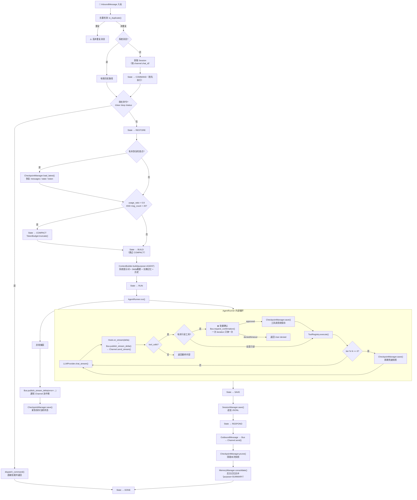

# MXWbot 第一版设计规格文档 (Design SPEC v1)

> **设计哲学**: 轻量、可维护、可扩展、安全优先
> **参考项目**: claw (多渠道) + nanobot (轻量架构) + hermes (记忆系统) + Harness (状态机)

---

## 一、项目目录结构总览

```
mxwbot/
├── __init__.py                          # 包入口，导出核心公共 API
├── pyproject.toml                       # 项目元数据与依赖声明
│
├── config/                              # ═══ 配置系统 ═══
│   ├── __init__.py                      # 导出 get_config / reload_config
│   ├── loader.py                        # 配置加载器（YAML/ENV → Schema）
│   ├── path.py                          # 运行时路径管理器
│   └── schema.py                        # Pydantic v2 配置模型全集
│
├── providers/                           # ═══ LLM 供应商抽象层 ═══
│   ├── __init__.py                      # 导出 LLMProvider / LLMResponse 等
│   ├── base.py                          # 抽象基类 + 公共数据结构（含 LLMCallPurpose）
│   ├── openai_provider.py               # OpenAI 适配
│   ├── anthropic_provider.py            # Anthropic 适配
│   ├── deepseek_provider.py             # DeepSeek 适配
│   └── registry.py                      # Provider 注册中心（工厂模式）
│
├── core/                                # ═══ 核心编排层 ═══
│   ├── __init__.py                      # 导出核心组件
│   ├── loop.py                          # Loop — 中央编排器（Session隔离并发）
│   ├── state.py                         # TurnState 状态机 + 降级策略
│   ├── context.py                       # ContextBuilder — 按 LLMCallPurpose 分支
│   ├── runner.py                        # AgentRunner — 纯引擎 + 策略驱动 Checkpoint
│   ├── hook.py                          # AgentHook — 钩子系统（含流式→Bus）
│   ├── skill.py                         # SkillLoader — 技能加载与热更新
│   ├── subagent.py                      # SubAgentManager — 完整子代理管理
│   │
│   └── tools/                           # 工具子系统
│       ├── __init__.py                  # 导出 Tool / ToolRegistry
│       ├── base.py                      # Tool 抽象基类 + JSON_TYPE_MAP + 类型转换
│       ├── register.py                  # ToolRegistry — 工具注册/管理/执行
│       ├── filesystem.py                # 文件系统工具（Read/Write/Edit/List/Glob/Grep）
│       ├── web.py                       # Web 工具（Search + Fetch，支持多供应商）
│       ├── shell.py                     # Shell 命令执行工具
│       ├── cron.py                      # Cron 定时任务工具
│       ├── mcp.py                       # MCP 协议兼容工具
│       └── sandbox.py                   # 沙箱执行工具（bubblewrap）
│
├── memory/                              # ═══ 记忆系统 ═══
│   ├── __init__.py                      # 导出 MemoryManager
│   ├── core.py                          # MemoryManager — 记忆统筹调度
│   ├── working_memory.py                # 工作记忆（当前会话上下文）
│   ├── episodic_memory.py               # 情景记忆（摘要提取与 Token 控制）
│   ├── long_term_memory.py              # 长期记忆（SQLite + FTS5 全文检索）
│   ├── retrieval.py                     # 混合检索引擎（关键词 + 语义）
│   ├── update.py                        # 记忆写入（重要性判断 + 结构化存储）
│   ├── summarizer.py                    # LLM 摘要与关键信息提取器（purpose=SUMMARY 隔离）
│   └── token_budget.py                  # Token 计数器与预算管理（含 usage_ratio）
│
├── channel/                             # ═══ 多渠道接入层 ═══
│   ├── __init__.py                      # 导出 Channel 基类 + 注册中心
│   ├── base.py                          # BaseChannel — 频道抽象基类（含 send_stream）
│   ├── weixin.py                        # 微信频道适配（itchat/wechaty）
│   ├── qq.py                            # QQ 频道适配（go-cqhttp/napcat）
│   └── email.py                         # 邮件频道适配（IMAP/SMTP）
│
├── session/                             # ═══ 会话管理 ═══
│   ├── __init__.py                      # 导出 SessionManager
│   └── manager.py                       # JSONL 会话持久化 + 异步锁 + 去重缓存 + 边界保护
│
├── checkpoint/                          # ═══ 检查点与恢复 ═══
│   ├── __init__.py                      # 导出 CheckpointManager
│   └── manager.py                       # CheckpointManager — 策略驱动的快照保存与恢复
│
├── bus/                                 # ═══ 消息总线 ═══
│   ├── __init__.py                      # 导出 MessageBus / InboundMessage / OutboundMessage
│   ├── messages.py                      # InboundMessage（含去重键） + OutboundMessage（含流式标记）
│   └── queue.py                         # MessageBus — 双向消息队列 + 流式通道
│
├── heartbeat/                           # ═══ 心跳与定时任务 ═══
│   ├── __init__.py                      # 导出 HeartbeatEngine
│   ├── scheduler.py                     # 后台定时调度器（threading.Thread，通过 asyncio.run_coroutine_threadsafe 安全投递）
│   └── storage.py                       # 任务持久化存储（SQLite）
│
├── watch/                               # ═══ 监控面板 ═══
│   ├── __init__.py                      # 导出 WatchPanel
│   ├── panel.py                         # Rich 终端 UI（颜色/面板区分事件）
│   └── metrics.py                       # 结构化指标体系（System/Agent/Channel/Degradation）
│
├── cli/                                 # ═══ 命令行入口 ═══
│   ├── __init__.py                      # CLI 包入口
│   └── main.py                          # Typer CLI 入口 + 子命令
│
├── skills/                              # ═══ 内置技能库 ═══
│   ├── __init__.py                      # Skills 包入口
│   ├── personality.py                   # 人格技能（总是加载）
│   └── builtin/                         # 内置技能定义文件（.md 格式）
│       ├── code-review.md               # 代码审查技能
│       ├── doc-writer.md                # 文档撰写技能
│       └── commit.md                    # Git 提交技能
│
├── utils/                               # ═══ 工具函数 ═══
│   ├── __init__.py                      # 导出公共工具
│   ├── security.py                      # 安全辅助（路径校验、命令注入检测）
│   ├── text.py                          # 文本处理（think 标签清洗、Token 估算）
│   ├── async_utils.py                   # 异步辅助（超时控制、并发限制）
│   └── logging.py                       # 结构化日志（JSONL 格式）
│
└── tests/                               # ═══ 测试 ═══
    ├── __init__.py
    ├── conftest.py                      # Pytest fixtures
    ├── test_config/                     # 配置测试
    ├── test_providers/                  # Provider 测试
    ├── test_core/                       # 核心编排测试
    ├── test_memory/                     # 记忆系统测试
    ├── test_channel/                    # 频道测试
    ├── test_tools/                      # 工具测试
    └── test_session/                    # 会话测试
```

---

## 二、系统架构图

### 2.1 分层架构总览

```
┌─────────────────────────────────────────────────────────────────────┐
│                        ENTRY LAYER                                   │
│  ┌──────────┐  ┌──────────┐  ┌──────────┐  ┌───────────────┐      │
│  │  WeChat  │  │    QQ    │  │  Email   │  │  CLI (typer)  │      │
│  │ Channel  │  │ Channel  │  │ Channel  │  │  mxwbot serve │      │
│  │·send()   │  │·send()   │  │·send()   │  │               │      │
│  │·send_str │  │·send_str │  │·send_str │  │               │      │
│  └────┬─────┘  └────┬─────┘  └────┬─────┘  └───────┬───────┘      │
│       │              │              │               │               │
├───────┼──────────────┼──────────────┼───────────────┼───────────────┤
│       ▼              ▼              ▼               ▼               │
│  ┌──────────────────────────────────────────────────────────────┐  │
│  │                     MESSAGE BUS（纯通道）                     │  │
│  │                                                               │  │
│  │  InboundMessage ──→ input_queue                                │  │
│  │  OutboundMessage ←── output_queues（按频道）                   │  │
│  │  StreamDelta      ←── stream_channels（按频道）                │  │
│  │  [确认] msg_type 复用上述队列，不新建通道                       │  │
│  └──────────────────────────────────────────────────────────────┘  │
│                              │                                      │
├──────────────────────────────┼──────────────────────────────────────┤
│                              ▼                                      │
│  ┌──────────────────────────────────────────────────────────────┐  │
│  │                    CORE ORCHESTRATOR                          │  │
│  │                        LoopPool                               │  │
│  │  ┌─────────────────────┐  ┌─────────────────────┐            │  │
│  │  │   Loop (session-1)  │  │   Loop (session-2)  │  ...       │  │
│  │  │  session Lock 串行   │  │  session Lock 串行   │            │  │
│  │  │                     │  │                     │            │  │
│  │  │  COMMAND → RESTORE →│  │  COMMAND → RESTORE →│            │  │
│  │  │  COMPACT* → BUILD → │  │  COMPACT* → BUILD → │            │  │
│  │  │  RUN → SAVE →       │  │  RUN → SAVE →       │            │  │
│  │  │  RESPOND → DONE     │  │  RESPOND → DONE     │            │  │
│  │  └─────────────────────┘  └─────────────────────┘            │  │
│  │         * COMPACT 仅当 usage_ratio > 0.8 时触发              │  │
│  │                                                               │  │
│  │  ┌──────────────────────────────────────────────────────┐    │  │
│  │  │  StateManager → ContextBuilder → AgentRunner → Session│   │  │
│  │  │       ↑              ↑               ↑            ↑   │    │  │
│  │  │  TurnState      SkillLoader    ToolRegistry   Checkpoint│  │
│  │  └──────────────────────────────────────────────────────┘    │  │
│  └──────────────────────────────────────────────────────────────┘  │
│                          │                                          │
│         ┌────────────────┼────────────────┐                        │
│         ▼                ▼                ▼                        │
│  ┌─────────────┐  ┌─────────────┐  ┌─────────────┐                │
│  │ MemoryManager│  │ProviderReg. │  │SubAgentMgr  │                │
│  │ W→E→L 三级  │  │ OAI/Anth/DS │  │ max=5 concurrent            │
│  │ purpose隔离  │  │             │  │ 独立Session  │                │
│  └─────────────┘  └─────────────┘  └─────────────┘                │
│                                                                     │
├─────────────────────────────────────────────────────────────────────┤
│                       INFRASTRUCTURE                                 │
│  ┌──────────┐  ┌──────────┐  ┌──────────┐  ┌──────────────┐      │
│  │ Heartbeat│  │  Watch   │  │  Config  │  │   Security   │      │
│  │ (cron)   │  │ (Rich UI)│  │ (Pydantic)│  │  (utils/)    │      │
│  │          │  │ +metrics │  │          │  │              │      │
│  └──────────┘  └──────────┘  └──────────┘  └──────────────┘      │
└─────────────────────────────────────────────────────────────────────┘
```

### 2.2 核心 Loop 处理流程



### 2.3 记忆系统三级架构 + Purpose 隔离

```
┌──────────────────────────────────────────────────────┐
│                  MemoryManager                       │
│                                                      │
│  consolidate()                 get_context()          │
│    │                             │                   │
│    ├─→ usage_ratio > 0.8?       │                   │
│    │     → summarizer 压缩       │                   │
│    │     → session.consolidated  │                   │
│    │                             │                   │
│    └─→ updater.extract_facts()  │                   │
│          → 重要性过滤 → 去重 →   ├─→ context_for_query()│
│                      ┌───────────┘                   │
│                      ▼                               │
│           ┌─────────────────┐                        │
│           │ LongTerm Memory │                        │
│           │ (SQLite + FTS5) │                        │
│           └─────────────────┘                        │
│                                                      │
│  短期记忆: Session.messages (JSONL, per-session)      │
│  当前任务: Session.active_task (Loop 设置)            │
└──────────────────────────────────────────────────────┘

LLMCallPurpose 隔离:
┌────────────────┬──────────────────┬──────────────────┐
│   purpose      │  记忆注入         │  Skills 注入      │
├────────────────┼──────────────────┼──────────────────┤
│ AGENT（正常对话）│ 完整检索 + 注入   │ XML概要 + 按需   │
│ SUMMARY（摘要） │ 禁止              │ 禁止             │
│ SUBAGENT       │ 禁止              │ 禁止             │
│ SYSTEM（内部）  │ 禁止              │ 禁止             │
└────────────────┴──────────────────┴──────────────────┘
```

### 2.4 状态转移与降级矩阵

```
        ┌──────────────────────────────────────────┐
        │           TurnState 状态机（修正版）        │
        │                                          │
        │  COMMAND → RESTORE → COMPACT* → BUILD    │
        │     │         ↑           ↓               │
        │     │         └── 异常回退 ─ RUN           │
        │     │                       ↓              │
        │     └────────────────→ SAVE               │
        │                          ↓                │
        │                       RESPOND → DONE      │
        │                                          │
        │  * COMPACT 仅当 usage_ratio > 0.8 且      │
        │    msg_count > 20 时触发，否则直接 BUILD   │
        └──────────────────────────────────────────┘

┌──────────────────┬────────────────────┬──────────────────┐
│     故障组件      │      降级行为       │     恢复策略      │
├──────────────────┼────────────────────┼──────────────────┤
│ MCP Server 断开   │ 该MCP工具不可用      │ 定时重连(指数退避) │
│ Memory DB 失败    │ 仅Session+本地文件   │ 自动切回内存模式   │
│ Channel 断开      │ 该频道消息暂存队列    │ 指数退避重连      │
│ Rate Limit 触发   │ 降低处理速度         │ 滑动窗口动态调整   │
│ Disk 满          │ 拒绝写操作/只读+告警  │ 主动告警通知      │
│ Runner 异常       │ Checkpoint恢复       │ load_latest()    │
└──────────────────┴────────────────────┴──────────────────┘
```

---

## 三、各模块详细说明

### 3.1 config/ — 配置系统

| 文件 | 职责 | 核心类/函数 |
|------|------|-------------|
| `loader.py` | 从 YAML/ENV/JSON 加载配置，合并优先级（ENV > YAML > 默认值），支持 `reload_config()` 热重载 | `load_config()`, `reload_config()`, `get_config()` |
| `path.py` | 基于 `MXWConfig.workspace` 推导所有运行时目录，自动创建缺失目录 | `get_*_dir()`, `get_*_path()`, `ensure_all_dirs()` |
| `schema.py` | 所有配置的 Pydantic v2 模型定义，严格类型校验，`SecretStr` 处理敏感信息 | `MXWConfig`, `ProviderConfig`, `ChannelConfig`（泛化 type/settings, 开闭原则）, `ToolsConfig`, `HeartBeatConfig`, `GatewayConfig`, `WebToolsConfig`, `WebSearchConfig`, `WebFetchConfig`, `ExecToolConfig`, `McpConfig`, `MemoryConfig`, `AgentDefaultConfig` |

**设计重点**:
- 单一 `MXWConfig` 根模型，所有子配置通过组合关系内聚
- 敏感字段使用 `SecretStr`，序列化时自动脱敏
- `path.py` 不依赖配置以外的全局状态，纯函数式推导

---

### 3.2 providers/ — LLM 供应商抽象

| 文件 | 职责 | 核心类/函数 |
|------|------|-------------|
| `base.py` | 定义 `LLMProvider` 抽象基类、`LLMResponse`、`LLMErrorInfo`、`LLMStreamChunk`、`ToolCallDelta`、`ToolCallRequest`、`TokenUsage`、`LLMCallPurpose` 枚举 | `LLMProvider`, `LLMResponse`, `LLMErrorInfo`, `LLMStreamChunk`, `ToolCallDelta`, `ToolCallRequest`, `TokenUsage`, `LLMCallPurpose` |
| `openai_provider.py` | OpenAI 适配实现（兼容 OpenAI/兼容 API） | `OpenAIProvider(LLMProvider)` |
| `anthropic_provider.py` | Anthropic Claude 适配实现 | `AnthropicProvider(LLMProvider)` |
| `deepseek_provider.py` | DeepSeek 适配实现 | `DeepSeekProvider(LLMProvider)` |
| `registry.py` | 工厂模式注册中心，通过 `provider_name` 获取实例 | `ProviderRegistry` |

**设计重点**:
- 非流式 `chat()` 返回 `LLMResponse`（含完整 content / tool_calls / usage）
- 流式 `chat_stream()` 返回 `AsyncIterator[LLMStreamChunk]`，由调用方自行聚合
- 每个 Provider 负责将内部格式统一转换为标准数据结构
- 新增供应商只需继承基类 + 注册即可（开闭原则）

**双模式接口 + 错误处理** — 流式/非流式分离，异常统一转为 `LLMResponse.error`:

```python
@dataclass
class TokenUsage:
    input_tokens: int = 0        # OpenAI prompt_tokens / Anthropic input_tokens
    output_tokens: int = 0       # OpenAI completion_tokens / Anthropic output_tokens
    cache_read_tokens: int = 0
    cache_write_tokens: int = 0
    extra: dict[str, int] = field(default_factory=dict)

@dataclass
class LLMErrorInfo:
    status_code: int | None = None
    kind: str | None = None      # "timeout" | "connection" | "api_error"
    type: str | None = None      # "rate_limit_exceeded" | "insufficient_quota" | …
    code: str | None = None      # Provider-specific error code
    retry_after_s: float | None = None
    should_retry: bool = False

@dataclass
class LLMResponse:
    content: str | None = None        # None when only tool calls
    tool_calls: list[ToolCallRequest] = []
    finish_reason: str = "stop"       # "stop" | "tool_calls" | "error" | …
    usage: TokenUsage = …
    retry_after: float | None = None
    reasoning_content: str | None = None   # DeepSeek-R1 / Kimi
    thinking_blocks: list[dict] | None = None  # Anthropic extended thinking
    error: LLMErrorInfo | None = None   # None = success

    @property
    def is_ok(self) -> bool: ...       # error is None

@dataclass
class LLMStreamChunk:
    delta: str | None = None
    tool_call_delta: ToolCallDelta | None = None
    finish_reason: str | None = None
    error: str | None = None           # Non-null when stream terminated with error

class LLMProvider(ABC):
    async def chat(self, messages, tools) -> LLMResponse: ...
    async def chat_stream(self, messages, tools) -> AsyncIterator[LLMStreamChunk]: ...
    async def chat_with_retry(self, messages, tools, *, max_attempts=None) -> LLMResponse: ...

    # Subclasses implement:
    async def _chat_impl(self, messages, tools) -> LLMResponse: ...
    async def _chat_stream_impl(self, messages, tools) -> AsyncIterator[LLMStreamChunk]: ...
    def _map_exception(self, exc) -> LLMResponse: ...    # SDK exception → error response

    @classmethod
    def _is_transient_error(cls, response: LLMResponse) -> bool: ...
```

**错误处理流** — 异常从不穿透到调用者:

```
chat() / chat_with_retry()
  → _safe_chat() / _run_with_retry()
    → _chat_impl()
    → except RateLimitError   → LLMErrorInfo(429, should_retry=True)
    → except APITimeoutError  → LLMErrorInfo(kind="timeout", should_retry=True)
    → except APIConnectionError → LLMErrorInfo(kind="connection", should_retry=True)
    → except AuthenticationError → LLMErrorInfo(401, should_retry=False)
    → except APIError          → LLMErrorInfo(kind="api_error")
```

**重试策略** — `chat_with_retry()` 自动重试 transient 错误:

```
默认 4 次尝试 (1 原始 + 3 重试)，退避: 1s → 2s → 4s
  → _is_transient_error() → True  → sleep + retry
                          → False → 立即返回（auth / quota 不重试）
  → error.retry_after_s 优先于默认退避
```

**LLMCallPurpose 枚举** — 解决记忆系统递归依赖:

```python
class LLMCallPurpose(Enum):
    AGENT    = "agent"
    SUBAGENT = "subagent"
    SUMMARY  = "summary"
    SYSTEM   = "system"
```

---

### 3.3 core/ — 核心编排层

#### 3.3.1 loop.py — 中央编排器（Session 隔离并发）

| 类/函数 | 职责 |
|----------|------|
| `LoopPool` | 全局并发管理：最多同时处理 20 个独立 Session，通过 `asyncio.Semaphore` 限流 |
| `Loop` | 六大组件的编排者，每个 Session 独立一个 Loop 实例 |
| `Loop.run(input_msg)` | 消息去重 → 命令分发 → 条件 Compact → 上下文构建 → Runner 执行 → 保存 |
| `Loop._get_session_lock(key)` | 同一 `channel:chat_id` 的消息串行处理（`asyncio.Lock`），不同 Session 并行 |
| `Loop._dispatch_command(cmd)` | 处理 `/clear` `/stop` `/status` 等斜杠命令 |
| `Loop._preprocess_text(text)` | 输入预处理（去冗余空白、压缩重复内容） |

**LoopPool 消费循环**（Bus 不做分发，LoopPool 拥有消费循环）:
```python
class LoopPool:
    _semaphore: asyncio.Semaphore(20)
    _session_locks: dict[str, asyncio.Lock]

    async def start(self):
        """从 Bus 持续消费消息，按 msg_type 分发"""
        while True:
            msg = await self._bus.input_queue.get()
            if msg.msg_type == "confirmation_response":
                # 确认响应 → 唤醒挂起的 request_confirmation
                event = self._bus._pending.pop(msg.ref_request_id, None)
                if event:
                    self._bus._results[msg.ref_request_id] = (msg.content == "approved")
                    event.set()
            else:
                asyncio.create_task(self._dispatch(msg))

    async def _dispatch(self, msg):
        async with self._semaphore:
            session_key = f"{msg.channel}:{msg.chat_id}"
            async with self._get_lock(session_key):
                loop = Loop(session_key, ...)
                await loop.run(msg)
```

**核心流程**:
```
1. 去重检测 → is_duplicate()? → 是则丢弃
2. 系统消息检测 → 特殊路径（有限历史）
3. 获取/创建 Session（按 channel:chat_id）
4. State → COMMAND（首先执行命令检测）
5. 斜杠命令分发（/clear、/stop、/status 等）→ 命令直接处理并结束
6. State → RESTORE → 检查是否有未恢复 Checkpoint → 有则恢复
7. TokenBudget.usage_ratio > 0.8 且 msg_count > 20 → COMPACT → 压缩历史
   否则跳过 COMPACT，直接 BUILD
8. State → BUILD → ContextBuilder.build(purpose=AGENT)
9. State → RUN → AgentRunner.run()
10. State → SAVE → SessionManager.save()
11. State → RESPOND → 发送 OutboundMessage
12. CheckpointManager.prune() 清理本次快照
13. MemoryManager.consolidate(purpose=SUMMARY) 后台记忆合并
14. State → DONE
```

#### 3.3.2 state.py — 事件驱动状态机

| 类 | 职责 |
|-----|------|
| `TurnState(Enum)` | **COMMAND → RESTORE → COMPACT → BUILD → RUN → SAVE → RESPOND → DONE** |
| `StateManager` | 事件驱动状态机：handler 返回事件 → 表查跳转，handler 不参与路由决策 |
| `DegradationPolicy` | 降级策略：MCP断开/内存DB失败/频道断开/RateLimit/Disk满/Runner异常 → 对应的 Fallback 行为 |

**事件驱动转移表**:

| (state, event) | → next | 说明 |
|---|---|---|
| (COMMAND, "shortcut") | SAVE | 斜杠命令 → 短路跳过 RESTORE...RUN |
| (COMMAND, "dispatch") | RESTORE | 普通消息 → 继续处理 |
| (RESTORE, "ok") | COMPACT | 恢复完成（或无待恢复） |
| (COMPACT, "ok") | BUILD | 无需压缩或压缩完成 |
| (BUILD, "ok") | RUN | 上下文构建完成 |
| (RUN, "ok") | SAVE | LLM 正常完成 |
| (RUN, "error") | RESTORE | 异常 → 回退到 Checkpoint 恢复 |
| (SAVE, "ok") | RESPOND | 会话持久化完成 |
| (RESPOND, "ok") | DONE | 回复已发送 |

**引擎循环**:
```python
sm = StateManager()
while not sm.is_terminal:
    handler = handlers[sm.current]   # _state_xxx 方法
    event = handler(ctx)             # 返回 "ok" / "error" / "shortcut" / "dispatch"
    sm.dispatch(event)               # 表查跳转
```

Handler 只描述结果，不关心跳到哪。转发表拥有全部路由决策。

**降级矩阵**:
| 故障组件 | 降级行为 | 恢复策略 |
|----------|----------|----------|
| MCP Server 断开 | 该 MCP 工具不可用，其余正常 | 定时重连(指数退避) |
| Memory DB 失败 | 仅使用 Session 历史 + 本地文件 | 自动切回内存模式 |
| Channel 断开 | 该频道消息暂存队列 | 指数退避重连 |
| Rate Limit 触发 | 自动降低处理速度 | 滑动窗口动态调整 |
| Disk 满 | 拒绝写操作，只读 + 告警 | 主动告警通知 |
| Runner 异常中断 | 从最近 Checkpoint 恢复 | load_latest() |

#### 3.3.3 context.py — 上下文构建器（按 Purpose 分支）

| 类/方法 | 职责 |
|----------|------|
| `ContextBuilder` | 组装上下文，根据 `LLMCallPurpose` 分支：AGENT → 完整上下文 / SUBAGENT / SUMMARY / SYSTEM → 最小上下文 |
| `build(purpose, session, user_msg, skills, memory)` | 入口方法，按 purpose 决定构建策略 |
| `_build_full()` | 完整上下文：Identity + Skills概要 + 长期记忆 + 历史 + 用户消息 |
| `_build_minimal()` | 最小上下文：仅 Identity + 用户消息（不注入 Skills、不检索记忆） |

**上下文结构（purpose=AGENT）**:
```
┌──────────────────────────────┐
│ Identity (平台/路径/准则)     │  ← 总是包含
├──────────────────────────────┤
│ Skills Summary (XML 列表)    │  ← 总是包含（轻量）
├──────────────────────────────┤
│ Long-term Memory (检索结果)  │  ← 有查询时包含
├──────────────────────────────┤
│ Always-load Skills (如人格)  │  ← 1-2个小技能全文
├──────────────────────────────┤
│ Conversation History         │  ← Token 预算截断后
├──────────────────────────────┤
│ Current User Message         │
└──────────────────────────────┘
```

**上下文结构（purpose=SUBAGENT/SUMMARY/SYSTEM）— 仅最小上下文，打破递归依赖**:
```
┌──────────────────────────────┐
│ Identity (平台/路径/准则)     │
├──────────────────────────────┤
│ Current Task Description     │  ← 仅任务描述，不注入记忆/Skills
└──────────────────────────────┘
```

#### 3.3.4 runner.py — 纯引擎循环（策略驱动 Checkpoint）

| 类 | 职责 |
|-----|------|
| `AgentRunSpec` | 单次 Agent 执行配置：消息列表、工具注册表、模型、最大迭代、Hook、**purpose**、**checkpoint_interval**、**bus**（用于确认通道） |
| `AgentRunner` | 纯引擎：LLM调用 → 工具执行 → 再调用的循环（含批量确认 + 流式异常通知） |
| `AgentRunResult` | 执行结果：最终内容、迭代次数、工具调用数、Token 消耗 |

**AgentRunner 核心循环（含确认 + 流式异常）**:
```python
async for chunk in provider.chat_stream(messages, tools):
    # 流式增量 → Hook 处理 → 转发到 Channel
    if chunk.delta:
        await hook.on_stream(chunk.delta)

    elif chunk.finish_reason:
        break  # 流结束

# 聚合 tool_calls（由 Hook 从 ToolCallDelta 累积完成）
tool_calls = hook.get_accumulated_tool_calls()

if tool_calls:
    all_tools = spec.tools.resolve(tool_calls)
    read_only = [t for t in all_tools if t.is_readonly]
    writable  = [t for t in all_tools if not t.is_readonly]

    if writable:
        # ★ 策略1: 工具调用前保存 Checkpoint
        if spec.checkpoint_callback:
            await spec.checkpoint_callback(...)

        # ★ 批量确认：一次 iteration 的所有非只读工具只弹一次
        approved = await spec.bus.request_confirmation(OutboundMessage(
            msg_type="confirmation_request",
            channel=spec.channel,
            chat_id=spec.chat_id,
            request_id=str(uuid4()),
            risk_level="write",
            content=json.dumps([
                {"name": t.name, "args_summary": str(t.args)[:200]}
                for t in writable
            ]),
            fallback_prompt=f"即将执行 {len(writable)} 个写操作，回复 Y 确认，N 拒绝",
            timeout_seconds=60,
        ))
        if not approved:
            results = [ToolResult(error="User denied") for _ in tool_calls]
        else:
            results = await spec.tools.execute(tool_calls)
    else:
        # 全是只读，直接执行
        results = await spec.tools.execute(tool_calls)

    messages.extend(format_results(results))

# 周期兜底 Checkpoint（工具/纯文本均适用）
if spec.checkpoint_callback and iteration > 0 and iteration % spec.checkpoint_interval == 0:
    await spec.checkpoint_callback(...)

except Exception as e:
    # ★ 流式异常 → 通知 Channel 展示中断信息
    await spec.bus.publish_stream_delta(StreamDelta(
        stream_id=spec.stream_id, channel=spec.channel,
        chat_id=spec.chat_id, error=str(e),
    ))
    # 紧急 Checkpoint
    if spec.checkpoint_callback:
        await spec.checkpoint_callback(..., emergency=True)
    raise
```

**保护机制**: `max_iterations=3`（默认）+ 60s 总超时 + Token 预算硬上限

#### 3.3.5 hook.py — 钩子系统

| 类 | 职责 |
|-----|------|
| `AgentHook` | 生命周期钩子基类：`before_iteration` / `on_stream` / `on_stream_end` / `before_execute_tools` / `after_iteration` / `finalize_content` |
| `StreamProcessHook` | 流式输出处理 Hook（think 标签清洗 + 增量计算 + **转发到 MessageBus 流式通道**）|

**流式处理管道（直达 Channel）**:
```
LLM raw_delta
  → prev_clean + delta
  → 去 think 标签
  → new_clean
  → incremental cut
  → Hook.on_stream(incremental)
    → MessageBus.publish_stream_delta(stream_id, incremental)
      → Channel.send_stream(chat_id, incremental)
```

#### 3.3.6 skill.py — 技能系统

| 类 | 职责 |
|-----|------|
| `SkillLoader` | 扫描工作区 → 解析 XML 摘要 → 按需加载完整内容 → 热更新 |
| `Skill` | 单个技能实体（name, description, path, content, dependencies）|
| `SkillMeta` | 技能元数据（轻量，用于列表展示）|

**Skill 文件格式 — YAML Frontmatter**:

每个 `.md` 技能文件必须以 YAML frontmatter 开头，定义元数据：

```markdown
---
name: code-review
description: 对代码变更进行审查，输出改进建议
version: "1.0"
dependencies: [git]
availability: always      # always | manual | auto
trigger_keywords:         # 可选：自动触发的关键词
  - review
  - 审查
---

# 代码审查技能

## 使用方式
...
```

**解析规则**:

```python
class SkillLoader:
    FRONTMATTER_RE = re.compile(r'^---\s*\n(.*?)\n---\s*\n', re.DOTALL)

    def _parse_frontmatter(self, raw: str) -> tuple[dict, str]:
        """返回 (metadata_dict, body_text)；无 frontmatter 则抛出 SkillParseError"""
        match = self.FRONTMATTER_RE.match(raw)
        if not match:
            raise SkillParseError(f"Missing frontmatter in {path}")
        metadata = yaml.safe_load(match.group(1))
        body = raw[match.end():]
        return metadata, body
```

**SkillMeta 完整定义**:

```python
@dataclass
class SkillMeta:
    name: str
    description: str
    version: str
    dependencies: list[str]       # 依赖的 CLI 工具名
    availability: str             # "always" | "manual" | "auto"
    trigger_keywords: list[str]   # 自动触发关键词
    path: Path
    available: bool               # 运行时：deps 是否全部满足
```

**加载策略**:
1. 启动时扫描 `skills/` 和 `~/.mxwbot/skills/` 目录，解析所有 `.md` 的 frontmatter
2. 生成 XML 格式技能摘要列表（注入上下文，仅 name+description+availability）
3. LLM 按 name 调用 skill 时，首次才加载完整 body 内容（懒加载）
4. `check_deps(name)` → 运行 `shutil.which(dep)` 检查依赖是否满足
5. 文件系统监控 → 文件变更自动触发热重载（watchdog）

#### 3.3.7 subagent.py — 子代理管理（完整定义）

**SubAgentConfig — 子代理配置**:
```python
@dataclass
class SubAgentConfig:
    task: str                         # 任务描述
    model: str | None = None          # None = 继承父 Agent 模型
    max_iterations: int = 5           # 最大迭代次数
    timeout_seconds: int = 120        # 总超时
    restrict_to_workspace: bool = True
    inherit_working_memory: bool = False  # 是否继承父工作记忆
    allowed_tools: list[str] | None = None  # None = 全部，[] = 无工具
```

**SubAgentResult — 执行结果**:
```python
@dataclass
class SubAgentResult:
    agent_id: str
    status: SubAgentStatus
    content: str | None
    iterations: int
    tool_calls_made: int
    token_usage: TokenUsage
    error: str | None
    duration_seconds: float
    events: list[SubAgentEvent]   # 关键事件日志
```

**SubAgentEvent — 事件日志**:
```python
@dataclass
class SubAgentEvent:
    timestamp: datetime
    event_type: str  # "spawned" | "tool_call" | "iteration" | "error" | "done"
    detail: str
```

**SubAgentManager — 生命周期管理**:
```python
class SubAgentManager:
    max_concurrent: int = 5
    _active: dict[str, SubAgent]
    _semaphore: asyncio.Semaphore
    _results: dict[str, SubAgentResult]  # 保留最近结果

    async def spawn(config: SubAgentConfig) -> str           # 返回 agent_id
    async def cancel(agent_id: str) -> None
    async def status(agent_id: str) -> SubAgentResult | None
    async def wait(agent_id: str, timeout=None) -> SubAgentResult
    async def active_count() -> int
    async def list_results() -> list[SubAgentResult]
```

**隔离清单**:
```
SubAgent 隔离:
├── 独立 ToolRegistry（不含 spawn tool，防递归创建子代理）
├── 内部使用临时消息列表（不通过 SessionManager），生命周期在 SubAgent 结束时销毁
├── 独立 ContextBuilder（精简系统提示词，不注入 Skills）
├── purpose=SUBAGENT（最小上下文，不检索长期记忆）
├── 可选择性继承父 Agent 的 Session 上下文
├── 工作目录 = workspace / subagents / {agent_id}
└── 超时后强制取消（asyncio.wait_for + cancel scope）
```

**错误处理**:
```python
try:
    result = await asyncio.wait_for(
        self.runner.run(spec),
        timeout=config.timeout_seconds,
    )
except asyncio.TimeoutError:
    result = SubAgentResult(status=CANCELLED, error="Timeout")
except Exception as e:
    result = SubAgentResult(status=ERROR, error=str(e))
```

---

### 3.4 tools/ — 工具子系统

| 文件 | 职责 |
|------|------|
| `base.py` | `Tool` 抽象基类：name / description / parameters (JSON Schema) / execute / is_readonly / can_parallel；全局 `JSON_TYPE_MAP`；类型转换 + JSON Schema 验证链 |
| `register.py` | `ToolRegistry`：注册/获取/列表/OpenAI格式Schema导出；Loop 启动时注册必备工具，其余按需懒注册 |
| `filesystem.py` | `ReadFileTool` / `WriteFileTool` / `EditFileTool` / `ListDirTool` / `GlobTool` / `GrepTool`，基类+具体实现，workspace约束+allowed_dir安全边界 |
| `web.py` | `WebSearchTool`（DuckDuckGo/Tavily/Kagi）+ `WebFetchTool`，通过配置选择供应商 |
| `shell.py` | `ShellTool`：执行 Shell 命令，支持 timeout/workspace限制/env白名单/pattern黑白名单 |
| `cron.py` | `CronTool`：定时提醒和任务调度 |
| `mcp.py` | `McpTool`：兼容 MCP 协议，连接/列举/调用 |
| `sandbox.py` | `SandboxTool`：基于 bubblewrap 的安全命令执行 |

---

### 3.5 memory/ — 记忆系统

经过 Phase 4 审计精简后，记忆系统只保留 4 个文件：

| 文件 | 职责 | 核心类/函数 |
|------|------|--------|
| `core.py` | `MemoryManager` — 统一记忆统筹：压缩触发、事实提取、上下文组装 | `MemoryManager` |
| `long_term_memory.py` | SQLite + FTS5 持久化存储 + `context_for_query()` 检索注入 | `LongTermMemory` |
| `summarizer.py` | LLM 摘要器：`extract_facts()` 提取结构化 fact，`summarise_session()` 压缩对话 | `MemorySummarizer` |
| `update.py` | 重要性评分 → 去重（词重叠 Jaccard）→ 批量写入 LTM | `MemoryUpdater` |
| `token_budget.py` | 纯函数：Token 计数、预算占比、token 裁剪 + smart 裁剪 | `count_tokens()`, `truncate_messages_smart()` |

设计中删除的模块及去处：
- `WorkingMemory` → `Session.active_task` + `LongTermMemory` 替代
- `EpisodicMemory` → 逻辑内联到 `MemoryManager.consolidate()`
- `MemoryRetrieval` → `context_for_query()` 直接放在 `LongTermMemory` 上

**记忆架构（精简后）**:
```
┌──────────────────────────────────────────────────────┐
│                  MemoryManager                       │
│                                                      │
│  consolidate(session)        get_context(query)      │
│    │                             │                   │
│    ├─→ usage_ratio > 0.8?       │                   │
│    │     → summariser 压缩      │                   │
│    │     → session.consolidated_count += N           │
│    │     → 返回 summary 文本     │                   │
│    │                             │                   │
│    └─→ updater.extract_facts()  │                   │
│          → 重要性过滤 → 去重     │                   │
│          → LongTermMemory        │                   │
│              │                   │                   │
│              ├───────────────────┘                   │
│              │  context_for_query(q)                 │
│              │  → FTS5 MATCH → 格式化文本块          │
│              │                                       │
│  SQLite + FTS5 (memory/memory.db)                   │
└──────────────────────────────────────────────────────┘

短期记忆 → Session.messages (JSONL)
长期记忆 → SQLite memories 表 (FTS5)
摘要隔离 → MemorySummarizer 使用 LLMCallPurpose.SUMMARY
```

---

### 3.6 channel/ — 多渠道层

| 文件 | 职责 |
|------|------|
| `base.py` | `BaseChannel` 抽象类：`start()/stop()/send()/send_stream()/on_message()` + 确认拦截模式 |

**BaseChannel 确认拦截模式**:

```python
class BaseChannel(ABC):
    name: str
    bus: MessageBus
    _pending_confirmations: dict[str, str]   # chat_id → request_id

    async def send(self, msg: OutboundMessage) -> None:
        if msg.msg_type == "confirmation_request":
            # 进入拦截模式：记录 pending，后续该 chat_id 的消息将被拦截
            self._pending_confirmations[msg.chat_id] = msg.request_id
            # TTL 清理：超时后自动移除，避免用户过期回复被误拦截
            loop = asyncio.get_running_loop()
            loop.call_later(msg.timeout_seconds or 60,
                            lambda: self._pending_confirmations.pop(msg.chat_id, None))
            # 渲染确认提示（按钮或 fallback 文本）
            if self.supports_interactive_buttons():
                await self._render_buttons(msg)
            else:
                await self._send_text(msg.chat_id, msg.fallback_prompt)
        else:
            await self._send_text(msg.chat_id, msg.content)

    async def on_message(self, raw_msg: dict) -> None:
        msg = self._parse(raw_msg)
        chat_id = msg.get("chat_id")
        content = msg.get("content", "").strip().upper()

        # ★ 拦截模式检测
        if chat_id in self._pending_confirmations:
            request_id = self._pending_confirmations.pop(chat_id)
            approved = content in ("Y", "YES", "是", "确认", "同意")
            await self.bus.publish_inbound(InboundMessage(
                msg_type="confirmation_response",
                channel=self.name,
                chat_id=chat_id,
                content="approved" if approved else "denied",
                ref_request_id=request_id,
            ))
            return  # 不投递为普通消息

        # 正常消息投递
        await self.bus.publish_inbound(InboundMessage(
            msg_type="message",
            channel=self.name,
            chat_id=chat_id,
            content=msg.get("content"),
            ...
        ))

    @abstractmethod
    def supports_interactive_buttons(self) -> bool: ...

    async def send_stream(self, chat_id: str) -> None:
        """从 Bus 订阅 StreamDelta 队列，持续发送增量直到 stream_end 或 error"""
        queue = await self.bus.subscribe_stream(self.name)
        while True:
            item: StreamDelta = await queue.get()
            if item.error:
                await self._send_chunk(chat_id, f"\n[响应中断: {item.error}]")
                break
            if item.delta:
                await self._send_chunk(chat_id, item.delta)
            if item.is_end:
                break
```

**确认拦截流程**:
```
确认请求到达 Channel.send():
  → msg_type == "confirmation_request"
  → 记录 _pending_confirmations[chat_id] = request_id
  → 支持按钮 → 渲染按钮，按钮回调直接投递 confirmation_response
  → 不支持按钮 → 发送 msg.fallback_prompt（如 "回复 Y 确认，N 拒绝"）

用户回复到达 Channel.on_message():
  → 检查 _pending_confirmations[chat_id]
  → 存在 → 拦截，解析 Y/N，投递 confirmation_response
  → 不存在 → 正常投递为普通消息

超时兜底:
  → Bus.request_confirmation() 中超时返回 False（视为拒绝）
  → Channel 侧的 _pending_confirmations 可设置 TTL 清理
```

**频道设计原则**: Channel 产生 `InboundMessage` → Bus → LoopPool 并发分发 → 各 Loop 处理 → 产生 `OutboundMessage` / `StreamDelta` → Bus → Channel 消费并发送

---

### 3.7 bus/ — 消息总线（纯通道 + 确认 + 流式异常）

| 文件 | 职责 |
|------|------|
| `messages.py` | `InboundMessage`（含 `msg_type` / `idempotency_key` / `ref_request_id`）+ `OutboundMessage`（含 `msg_type` / 确认字段 / `fallback_prompt`）+ `StreamDelta`（含 `is_end` / `error`） |
| `queue.py` | `MessageBus` — 纯通道：`publish_*` / `subscribe_*` + `request_confirmation()`；**消费循环归 LoopPool，Bus 不做分发** |

**核心接口**:
```python
class MessageBus:
    input_queue: asyncio.Queue[InboundMessage]
    output_queues: dict[str, asyncio.Queue[OutboundMessage]]
    _stream_channels: dict[str, asyncio.Queue[StreamDelta]]

    # ── 消息投递与订阅 ──
    async def publish_inbound(self, msg: InboundMessage) -> None: ...
    async def publish_outbound(self, msg: OutboundMessage) -> None: ...
    async def subscribe(self, channel_name: str) -> asyncio.Queue[OutboundMessage]: ...

    # ── 流式通道 ──
    async def publish_stream_start(self, session_id: str) -> str: ...
    async def publish_stream_delta(self, delta: StreamDelta) -> None: ...
    async def publish_stream_end(self, stream_id: str) -> None: ...
    async def subscribe_stream(self, channel_name: str) -> asyncio.Queue[StreamDelta]: ...

    # ── 确认通道（复用 output_queues + input_queue，靠 msg_type 区分） ──
    _pending: dict[str, asyncio.Event]
    _results: dict[str, bool]

    async def request_confirmation(self, req: OutboundMessage) -> bool:
        """发出确认请求 → publish_outbound → 挂起等待 Channel 通过 publish_inbound 回复"""
        event = asyncio.Event()
        self._pending[req.request_id] = event
        await self.publish_outbound(req)
        try:
            await asyncio.wait_for(event.wait(), timeout=req.timeout_seconds or 60)
        except asyncio.TimeoutError:
            return False  # 超时视为拒绝
        return self._results.pop(req.request_id, False)
```

**消息数据结构**:
```python
class InboundMessage:
    id: str
    msg_type: str = "message"          # "message" | "confirmation_response"
    idempotency_key: str               # f"{channel}:{chat_id}:{platform_msg_id}"
    channel: str
    chat_id: str
    content: str
    ref_request_id: str | None = None  # 确认响应关联的请求 ID
    timestamp: datetime
    metadata: dict

class OutboundMessage:
    msg_type: str = "message"          # "message" | "confirmation_request" | "stream"
    channel: str
    chat_id: str
    content: str
    reply_to: str | None = None        # 关联原始 InboundMessage.id（OutboundMessage 以此为唯一身份标识）
    # 确认类消息专用
    request_id: str | None = None      # confirmation_request 的请求 ID
    risk_level: str | None = None      # "readonly" | "write" | "shell"
    timeout_seconds: int | None = None # 确认超时（秒），超时视为拒绝
    fallback_prompt: str | None = None # 纯文本频道降级提示（无法渲染按钮时使用）
    timestamp: datetime
    metadata: dict

class StreamDelta:
    stream_id: str
    channel: str
    chat_id: str
    delta: str
    seq: int                           # 序列号，保证顺序
    is_end: bool = False               # True 表示流正常结束
    error: str | None = None           # 非空表示流异常中断
```

**消息流**:
```
Channel → Bus.publish_inbound(InboundMessage)
  → LoopPool.start() 消费循环获取
    → 按 msg_type 分发:
        "confirmation_response" → Bus._pending[ref_request_id].set()
        "message"              → LoopPool._dispatch(session_key) → Loop.run()
  → [流式] Hook.on_stream → Bus.publish_stream_delta(StreamDelta) → Channel.send_stream()
  → [中断] Runner 异常 → Bus.publish_stream_delta(StreamDelta(error=...)) → Channel 展示中断
  → [完整] Bus.publish_outbound(OutboundMessage) → Channel.send()
  → [确认] Bus.request_confirmation(OutboundMessage(msg_type="confirmation_request")) → Channel.send()
         → 用户回复 → Channel → Bus.publish_inbound(InboundMessage(msg_type="confirmation_response"))
```

---

### 3.8 checkpoint/ — 检查点与恢复（策略驱动）

| 文件 | 职责 |
|------|------|
| `manager.py` | `CheckpointManager` — **策略驱动**的快照保存（非每次迭代），意外中断后从最近检查点恢复 |

**数据结构**:

| 类 | 字段 | 职责 |
|-----|------|------|
| `CheckpointSnapshot` | id, session_id, iteration, messages, tool_results, token_usage, state, created_at | 完整快照 |
| `CheckpointSummary` | id, iteration, state, created_at | 轻量摘要 |

**保存策略（三种触发时机）**:

| 时机 | 条件 | 理由 |
|------|------|------|
| **工具调用前** | `response.tool_calls` 非空 | 工具执行是最可能失败/超时的环节，避免重复消耗 LLM Token |
| **周期兜底** | `iteration > 0 AND iteration % checkpoint_interval == 0`（默认 N=2） | 纯文本多轮对话时的备份保护 |
| **异常紧急** | `except Exception` 块中 | Runner 崩溃时紧急保存当前状态 |

**核心方法**:

| 方法 | 职责 |
|------|------|
| `save(session_id, iteration, messages, tool_results, token_usage, state)` | 原子写入（临时文件 + rename） |
| `load_latest(session_id)` | 加载最近快照，无则返回 None |
| `load(checkpoint_id)` | 按 ID 加载 |
| `list_by_session(session_id)` | 列出摘要 |
| `prune(session_id, keep_last=5)` | 正常完成时清理本次快照 |

**恢复流程**:
```
Loop.run() 进入时 (State → RESTORE):
  → CheckpointManager.load_latest(session_id)
    → 有快照? 是 → 恢复 messages / tool_results / token_usage / TurnState
       → 从断点继续执行（跳过已完成迭代）
       否 → 正常冷启动

Runner.run() 中:
  → 仅三种时机保存（工具前 / 周期 / 异常）
  → 正常完成不保留额外快照

Loop 正常完成:
  → CheckpointManager.prune(session_id)
```

---

### 3.9 session/ — 会话管理

| 文件 | 职责 |
|------|------|
| `manager.py` | `SessionManager` + `Session` — JSONL 持久化 + `get_history()` 上下文组装管道 + 崩溃修复 + `asyncio.Lock` + **去重缓存** + 结构性 compact |

**Session 字段**:
```python
@dataclass
class Session:
    session_key: str                # f"{channel}:{chat_id}"
    messages: list[dict]            # 完整对话历史 (role/content/tool_calls/...)
    active_task: str | None         # Agent 当前任务 (Loop 设置)
    consolidated_count: int = 0     # 已压缩的消息数 (MemoryManager 维护)
    session_summary: str | None     # messages[:consolidated_count] 的压缩摘要
```

**`get_history()` 上下文组装管道**:
```
原始 messages[consolidated_count:]  (只取未压缩部分)
  → max_messages 截断
  → user turn 对齐 (_find_user_turn_start)
  → 去孤儿 tool result (_remove_orphaned_tool_results)
  → assistant 文本清洗 (clean_assistant_replay_text)
  → media 占位符合成 ([image: path])
  → timestamp 注入 (可选, 仅 user 消息)
  → token 裁剪 (从尾部倒序保留)
  → 再次 user turn 对齐
  → 再次去孤儿 tool
```

**`Session.append_message() / SessionManager.save_inbound()`**:
```python
# 通用消息追加 (LLM 标准格式)
session.append_message({"role": "assistant", "content": "..."})
session.append_message({"role": "tool", "tool_call_id": "...", "content": "..."})

# 入站消息转换
sm.save_inbound(session, inbound_msg)
  → {"role": "user", "content": msg.content, "timestamp": ..., "msg_id": ...}
```

**`SessionManager.compact()` 结构性保护**:
截断前对齐 user turn + 去孤儿 tool result，同时调整 `consolidated_count` 指针：
```python
retained = messages[-keep:]
retained = align_user_turn(retained)
retained = remove_orphaned_tools(retained)
session.consolidated_count -= dropped
```

**`SessionManager.close() / Session.clear()`**:
```
close(session)
  → session.clear()   # messages=[], active_task=None, consolidated_count=0
  → 从 _sessions / _locks / _dedup 缓存移除
  → JSONL 文件保留在磁盘
```

**去重机制**:
```python
class SessionManager:
    _recent_msg_ids: dict[str, set[str]]  # session_key → 最近 100 个消息 ID
    _dedup_window: int = 100

    def is_duplicate(self, msg: InboundMessage) -> bool:
        """使用 idempotency_key 判断消息重复"""
        key = msg.idempotency_key
        session_key = f"{msg.channel}:{msg.chat_id}"
        if key in self._recent_msg_ids.get(session_key, set()):
            return True
        # 记录并 LRU 淘汰
        sid_set = self._recent_msg_ids.setdefault(session_key, set())
        sid_set.add(key)
        if len(sid_set) > self._dedup_window:
            # 移除最早的一半
            ...
        return False
```

**安全设计**:
- JSONL 日常追加写入（行级原子），不原地修改
- Compact 重写：临时文件 + `os.replace()` 原子替换 + 结构性对齐
- 文件名校验：`channel_chat_id.jsonl`，防止路径穿越
- 单 Session 文件最大 1000 条消息，超出自动 compact
- **崩溃修复**：`_load_jsonl()` 先全文件解析；失败 fallback 到逐行恢复
- **写盘再缓存**：`session.append_message()` 先写 `aiofiles`，成功才更新内存

---

### 3.9.1 智能 Token 裁剪

`truncate_messages_smart()` 在纯 token 裁剪基础上增加结构性保护：

```
messages
  → token 裁剪（保留 system + 最新消息）
  → 保留 system head → 对齐 user turn 起点
  → 移除孤儿 tool result（tool_call_id 无匹配）
  → 若截断点仍是 assistant/tool → 向原始列表回退找 user
```

防止两种上下文破坏：对话从中途 assistant 开始、tool result 找不到对应 tool_call。
### 3.10 heartbeat/ — 心跳引擎

| 文件 | 职责 |
|------|------|
| `scheduler.py` | `TaskScheduler` — `threading.Thread(daemon=True)` 后台定时调度，通过 `asyncio.run_coroutine_threadsafe` 向主事件循环投递消息 |
| `storage.py` | `TaskStorage` — SQLite 持久化任务，重启不丢失 |

**实现要点**:
```python
class TaskScheduler:
    def __init__(self, storage: TaskStorage, bus: MessageBus, loop: asyncio.AbstractEventLoop):
        self._thread: threading.Thread | None = None
        self._storage = storage
        self._bus = bus
        self._loop = loop
        self._running = False

    def start(self):
        self._running = True
        self._thread = threading.Thread(target=self._run, daemon=True)
        self._thread.start()

    def _run(self):
        while self._running:
            for task in self._storage.get_due():
                asyncio.run_coroutine_threadsafe(
                    self._bus.publish_inbound(InboundMessage(
                        msg_type="message",
                        channel="system",
                        chat_id=task.owner,
                        content=f"[Scheduled] {task.prompt}",
                        ...
                    )),
                    self._loop,
                )
            time.sleep(1)
```
- 心跳任务复用 `publish_inbound` 投递为 `InboundMessage(channel="system")`，走正常 Loop 处理，无需额外路径
- `daemon=True` 保证主进程退出时线程自动终止

---

### 3.11 watch/ — 监控面板

| 文件 | 职责 |
|------|------|
| `panel.py` | `WatchPanel` — Rich 终端 UI，颜色/面板区分事件类型（INFO=绿/WARN=黄/ERROR=红/TOOL=蓝/LLM=紫），针对 Loop 核心事件进行审计 |
| `metrics.py` | 结构化指标体系，四类指标结构体 |

**四类指标定义**:

```python
@dataclass
class SystemMetrics:
    """系统级指标（WatchPanel 定期采集）"""
    uptime_seconds: float
    active_sessions: int
    total_sessions: int
    queue_depth_input: int
    queue_depth_per_channel: dict[str, int]
    memory_usage_mb: float
    disk_usage_ratio: float

@dataclass
class AgentMetrics:
    """Agent 处理指标"""
    total_messages_processed: int
    messages_per_minute: float
    avg_latency_ms: float
    p95_latency_ms: float
    p99_latency_ms: float
    avg_iterations_per_turn: float
    avg_tokens_per_turn: int
    tool_call_success_rate: float
    error_rate: float
    dedup_dropped: int              # 去重丢弃消息数

@dataclass
class ChannelMetrics:
    """频道级指标"""
    channel_name: str
    connected: bool
    messages_in: int
    messages_out: int
    stream_chunks_sent: int
    last_heartbeat: datetime

@dataclass
class DegradationEvents:
    """降级事件记录"""
    component: str
    event_type: str   # "disconnection" | "rate_limit" | "disk_full" | "runner_crash"
    timestamp: datetime
    recovered: bool
    recovery_time_seconds: float | None
```

---

### 3.12 cli/ — 命令行入口

| 文件 | 职责 |
|------|------|
| `main.py` | 基于 Typer 的 CLI：`mxwbot serve`（启动服务）、`mxwbot config`（配置管理）、`mxwbot watch`（打开监控面板）、`mxwbot skill list`（列出技能）|

---

### 3.13 utils/ — 工具函数

| 文件 | 职责 |
|------|------|
| `security.py` | 路径穿越检测、命令注入模式匹配、敏感信息过滤 |
| `text.py` | `clean_think_tags()` 清洗 `<think>` 标签、`estimate_tokens()` Token 估算、`truncate_messages()` 消息裁剪 |
| `async_utils.py` | `timeout()` 异步超时包装器、`ConcurrencyLimiter` 并发控制 |
| `logging.py` | 结构化日志（JSONL），支持 Level/Module/Timestamp 过滤 |

---

## 四、优秀设计重点与介绍

### 4.1 六大设计原则落地

| 原则 | 落地方式 |
|------|----------|
| **开闭原则** | Provider / Channel / Tool 均采用抽象基类 + 注册机制，新增无需修改核心代码 |
| **单一职责** | Loop 只做编排，Runner 只做引擎循环，ContextBuilder 只做上下文组装 |
| **迪米特法则** | 模块间通过接口/总线通信，Loop 不直接操作 Channel 内部 |
| **接口隔离** | AgentHook 只暴露必要生命周期方法，Tool 只暴露 name/description/execute |
| **依赖倒转** | 所有高层模块依赖抽象（LLMProvider / Tool / BaseChannel），不依赖具体实现 |
| **安全优先** | 工具级安全边界（路径校验/命令注入检测/沙箱）、配置敏感字段脱敏 |

### 4.2 核心架构亮点

**1. 三层增强 ReAct 循环**
```
Layer 1: Plan — 复杂任务自动分解为子任务（任务复杂度 > 阈值时触发）
Layer 2: Enhanced ReAct — Context → Reason → Act → Observe → Reflect（含预算+超时）
Layer 3: Metacognition — 结果验证 → 自我评估 → 记忆更新
```

**2. State 锚点 + 降级矩阵**
- 每轮对话经过 8 个显式状态，监控可精确到状态锚点
- COMMAND 前置，避免无意义的资源消耗
- COMPACT 仅在高 Token 压力 + 长对话时触发（守卫条件）
- 6 种故障场景有预定义降级策略，保证 Never Crash Silently

**3. Session 级并发隔离**
- 同一 Session 串行，不同 Session 并行
- `asyncio.Semaphore(20)` 全局并发上限
- 多用户同时在线的微信/QQ/Email 互不阻塞

**4. 策略驱动 Checkpoint**
- 仅在工具调用前 + 周期兜底 + 异常紧急三种时机保存
- 避免每次迭代写磁盘的开销
- 正常完成自动清理，不占磁盘

**5. Purpose 隔离打破记忆递归**
- `LLMCallPurpose` 四元枚举：AGENT / SUBAGENT / SUMMARY / SYSTEM
- MemorySummarizer 使用 `SUMMARY`、SubAgent 使用 `SUBAGENT` → ContextBuilder 走最小上下文
- 彻底避免「摘要 LLM 调用 → 注入记忆 → 再次检索 → 循环」

**6. 流式直达 Channel**
- `MessageBus.publish_stream_delta()` + `Channel.send_stream()`
- 增量文本直接从 LLM → Bus → Channel → 用户
- 用户看到的响应延迟大幅降低

**7. 消息去重**
- `idempotency_key` + SessionManager 去重缓存
- 网络抖动 / Channel 重连不会导致重复处理

**8. 批量工具确认**
- 非只读工具执行前，一次 iteration 只弹一次确认
- 复用 OutboundMessage/InboundMessage 现有通道，靠 msg_type 区分
- 超时自动拒绝，安全第一

**9. 流式异常 Channel 通知**
- Runner 异常时通过 StreamDelta.error 通知 Channel
- 用户不会看到消息断在半截

**10. Heartbeat 线程安全**
- threading.Thread + asyncio.run_coroutine_threadsafe
- 复用 publish_inbound 投递，无需额外通道

### 4.3 节省 Token 的设计

1. **Skills Summary XML**: 只注入技能名称和一句话描述，不加载全文
2. **Episodic Memory 压缩**: 对话轮次达到阈值自动摘要压缩，保留关键信息
3. **Think 标签清洗**: 流式输出中去除推理标签，仅发送最终内容给用户
4. **消息预处理**: 输入去冗余空白、合并重复内容
5. **渐进式 Memory 加载**: 先检索再注入，不是全量注入上下文
6. **Checkpoint 恢复**: 中断后从快照续跑，避免从头重复消耗 Token
7. **COMPACT 守卫条件**: 仅在高压力长对话时才压缩，短对话跳过

### 4.4 安全设计清单

- [x] `SecretStr` 保护 API Key 等敏感配置
- [x] `allowed_dir` 文件系统工具边界限制
- [x] `ShellTool` 命令注入模式检测 + sandbox 模式
- [x] 路径穿越检测 (`security.py`)
- [x] Session JSONL 文件名校验 + 行级原子写入
- [x] Token / CPU / 内存 / 时间 四维预算硬上限
- [x] 工具只读标记 (`is_readonly`)，非只读工具批量确认（一次 iteration 一次，超时自动拒绝）
- [x] 消息去重 (`idempotency_key`)
- [x] Checkpoint 快照原子写入（tmp + rename）
- [x] SubAgent 禁止递归 spawn（ToolRegistry 不含 spawn tool）

---

## 五、启动流程

```
CLI (cli/main.py)
  → load_config("config.yaml")
    → MXWConfig (Pydantic 验证)
      → ensure_all_dirs() 创建运行时目录
  → ProviderRegistry 初始化 LLM Provider
  → MemoryManager 初始化 SQLite + FTS5
  → SkillLoader.scan_workspace() 扫描技能
  → CheckpointManager 初始化检查点目录
  → SessionManager 恢复活跃会话（恢复去重缓存 + 检测未恢复检查点）
  → HeartbeatEngine 启动定时任务
  → MessageBus 创建队列 + 流式通道
  → Channel(s) 启动（weixin / qq / email）
  → LoopPool 启动（asyncio.Semaphore(20) + session locks + 消费循环 start()）
  → 等待消息…

消息到达:
  Channel.on_message → Bus.publish_inbound(InboundMessage)
    → LoopPool.start() 消费循环获取
      → msg_type == "confirmation_response" → 唤醒等待的 request_confirmation
      → msg_type == "message" → SessionManager.is_duplicate()? 是 → 丢弃
        → LoopPool._dispatch(session_key, msg)
          → [并发控制] Semaphore + session Lock
          → Loop.run(msg) → [状态机 COMMAND → ... → DONE]
          → [流式] Bus.publish_stream_delta → Channel.send_stream()
          → [中断] StreamDelta(error=...) → Channel 展示中断
          → [完整] Bus.publish_outbound → Channel.send()
```

---

## 六、依赖项 (pyproject.toml 节选)

```toml
[project]
name = "mxwbot"
version = "0.1.0"
requires-python = ">=3.11"

dependencies = [
    "pydantic>=2.0",
    "typer>=0.9",
    "rich>=13.0",
    "httpx>=0.25",
    "openai>=1.0",
    "anthropic>=0.30",
    "watchdog>=4.0",
    "croniter>=2.0",
    "tiktoken>=0.5",
    "aiofiles>=23.0",
    "pyyaml>=6.0",
]

[project.optional-dependencies]
wechat = ["wechaty>=0.10"]
qq = ["napcat>=1.0"]
email = ["aioimaplib>=1.0", "aiosmtplib>=3.0"]
sandbox = ["bubblewrap>=0.1"]
```

---

> **版本**: v1.2 | **日期**: 2026-05-11 | **状态**: 设计评审通过
